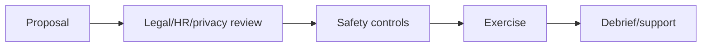
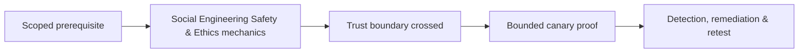

# Social Engineering Safety & Ethics

Define informed organizational authorization, minimal deception, protected groups, prohibited personal themes, no real credential collection, privacy, secure data, stop authority, support, debrief, and non-punitive use.



Prohibit medical/family distress, threats, harassment, discrimination, real financial loss, uncontrolled public embarrassment, and targeting unrelated personal accounts. Mastery lab: risk-assess five scenarios and redesign or reject unsafe ones.

## Safety case

Treat every exercise as a documented safety case. Identify participants and bystanders, plausible harms, existing safeguards, residual risk, decision owner, stop authority, support route, and post-exercise review. Authorization by a manager does not override employment law, privacy obligations, union agreements, accessibility needs, or human dignity.

Use data minimization by design: synthetic credentials, opaque participant IDs, aggregate reporting, narrow retention, encryption, and role-limited access. Operators must know how to respond if a participant reveals abuse, self-harm, fraud, medical information, or another real emergency; the exercise stops and the established safeguarding process takes precedence.

```text
Risk: recipient believes employment is threatened
Likelihood: medium    Severity: high
Decision: reject scenario
Replacement: routine document-sharing invitation with harmless canary
```

Debrief quickly and non-punitively. Explain the control being tested, how data will be used, and where support is available. Delete raw identifiers on schedule. Ethical mastery is the ability to produce reliable security evidence with the least deception and harm—not the ability to make a scenario maximally convincing.

---
> 🔼 Up: [[Social Engineering Exercise Governance & Metrics]]

## Core Concept

**Social Engineering Safety & Ethics** is the atomic learning objective of this note. Identify its trust boundary, prerequisites, attacker-controlled input or state, vulnerable transformation, violated security invariant, minimum evidence, business consequence, and safe stopping point. The mechanism must remain explainable without depending on a specific product.

## Visual Attack Flow



## Practical Payloads & Execution

```text
exercise=Social Engineering Safety & Ethics
cohort=privacy-approved canary group
maximum_action=harmless marker
real_credentials_collected=false
```

### Expected output

```text
prevented_or_reported=true
participant_harm=none
control_owner=identified
```

Treat the output as proof of only the stated condition. Repeat with a negative control, preserve timestamps and the affected build, and never expand impact merely because another path appears reachable.

## Real-World Scenario

A privacy-approved enterprise exercise applies **Social Engineering Safety & Ethics** with synthetic identities and a harmless canary action. Legal, HR, privacy, and the white team define prohibited themes and stop conditions; results measure process and control performance rather than individuals.

The durable remediation belongs at the authoritative enforcement layer. Retest the original condition and meaningful variants while verifying legitimate workflows still function.
