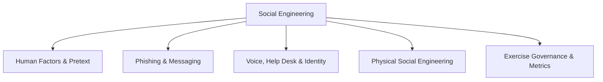

# Social Engineering

> [!abstract] Major pillar of [[Offensive Security]]
> Authorized testing of the human attack surface: influence principles, pretext design, phishing and voice workflows, physical-security scenarios, payload-delivery governance, safety boundaries, measurement, and user-centered remediation.

## 🗺️ Zero-to-Mastery Learning Path

1. [[Human Factors & Pretext Development]]
2. [[Social Engineering Exercise Governance & Metrics]]
3. [[Phishing & Messaging Security Testing]]
4. [[Voice, Help Desk & Identity Verification]]
5. [[Physical Social Engineering]]

---
> 🔼 Up: [[Offensive Security]]
