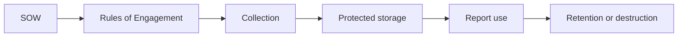
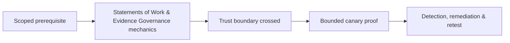

# Statements of Work & Evidence Governance

A Statement of Work defines commercial and delivery obligations; the Rules of Engagement defines operational behavior. Evidence governance controls collection, access, transfer, retention, legal holds, and destruction.



## SOW essentials

Objectives, systems, dates, assumptions, deliverables, acceptance, dependencies, client responsibilities, change control, fees, and liability must align with the technical scope. Ambiguity about subsidiaries, cloud tenants, third parties, or production testing is a stop condition.

## Evidence classification

Classify credentials, personal data, production records, vulnerability details, packet captures, source code, and exploit artifacts. Apply least privilege, encryption, immutable hashes, transfer logging, and named custodians.

```shell-session
analyst@workstation:~$ sha256sum evidence/F-07-request.txt
e58c...  evidence/F-07-request.txt
analyst@workstation:~$ printf '%s\n' 'F-07,restricted,lead+reviewer,delete+30d' >> evidence-register.csv
```

## Chain of custody

Record collector, UTC timestamp, source, method, original hash, storage location, transformations, access, and disposition. Working copies must remain traceable to originals.

## Mastery exercise

Write a mini-SOW and evidence plan for a production web/API assessment involving personal data and a third-party payment provider. Resolve scope, exclusions, emergency contacts, retention, and report distribution before testing.

---
> 🔼 Up: [[Methodologies & Frameworks]]

## Core Concept

**Statements of Work & Evidence Governance** is the atomic learning objective of this note. Identify its trust boundary, prerequisites, attacker-controlled input or state, vulnerable transformation, violated security invariant, minimum evidence, business consequence, and safe stopping point. The mechanism must remain explainable without depending on a specific product.

## Visual Attack Flow



## Practical Payloads & Execution

```text
engagement_action=Statements of Work & Evidence Governance
asset=C2R-CANARY
identity=authorized-test-principal
impact_ceiling=single synthetic proof
```

### Expected output

```text
expected_output=C2R_CANARY_PROOF
cleanup=verified
retest_condition=recorded
```

Treat the output as proof of only the stated condition. Repeat with a negative control, preserve timestamps and the affected build, and never expand impact merely because another path appears reachable.

## Real-World Scenario

A regulated enterprise assessment applies **Statements of Work & Evidence Governance** to a canary asset. Scope, evidence provenance, decision points, control outcomes, cleanup, ownership, and retest criteria are recorded so another qualified operator can reproduce the conclusion.

The durable remediation belongs at the authoritative enforcement layer. Retest the original condition and meaningful variants while verifying legitimate workflows still function.
