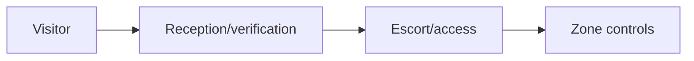
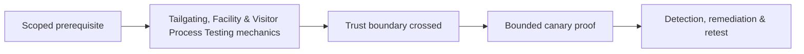

# Tailgating, Facility & Visitor Process Testing

Test reception, visitor sponsorship, badges, escorts, turnstiles, delivery/vendor workflows, secure-zone challenge culture, lost badges, and incident reporting.



Life safety overrides the exercise. Exclude emergency exits, medical/childcare areas, occupied sensitive spaces, and forced entry. Use visible authorization and white-team monitoring. Mastery lab: exercise one visitor and one delivery scenario with a canary destination and immediate debrief.

## Zone-based assessment

Map public, reception, employee, restricted, and critical zones. For each transition, identify the responsible control: receptionist validation, sponsor confirmation, badge issuance, anti-passback, turnstile, escort, guard challenge, camera coverage, or locked cabinet. A badge is an identifier, not proof that its holder belongs in every zone.

```text
Scenario: scheduled courier with synthetic package
Entry: loading reception
Canary destination: marked test shelf before restricted door
Pass: order verified, temporary badge issued, escort maintained
Stop: emergency activity, confrontation, uncontrolled access
```

Operators carry an authorization letter and immediate reveal mechanism. They do not defeat locks, block doors, photograph sensitive material, enter occupied private areas, or pressure staff after a challenge. Record control events and timings rather than employee names. Validate lost-badge revocation, visitor expiration, contractor sponsorship, delivery custody, and after-hours procedures. Debrief challenged staff positively; the desired culture makes polite verification normal and gives employees a fast escalation route.

---
> 🔼 Up: [[Physical Social Engineering]]

## Core Concept

**Tailgating, Facility & Visitor Process Testing** is the atomic learning objective of this note. Identify its trust boundary, prerequisites, attacker-controlled input or state, vulnerable transformation, violated security invariant, minimum evidence, business consequence, and safe stopping point. The mechanism must remain explainable without depending on a specific product.

## Visual Attack Flow



## Practical Payloads & Execution

```text
exercise=Tailgating, Facility & Visitor Process Testing
cohort=privacy-approved canary group
maximum_action=harmless marker
real_credentials_collected=false
```

### Expected output

```text
prevented_or_reported=true
participant_harm=none
control_owner=identified
```

Treat the output as proof of only the stated condition. Repeat with a negative control, preserve timestamps and the affected build, and never expand impact merely because another path appears reachable.

## Real-World Scenario

A privacy-approved enterprise exercise applies **Tailgating, Facility & Visitor Process Testing** with synthetic identities and a harmless canary action. Legal, HR, privacy, and the white team define prohibited themes and stop conditions; results measure process and control performance rather than individuals.

The durable remediation belongs at the authoritative enforcement layer. Retest the original condition and meaningful variants while verifying legitimate workflows still function.
