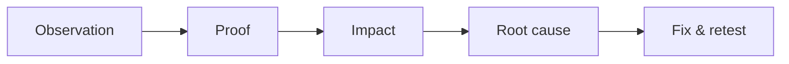
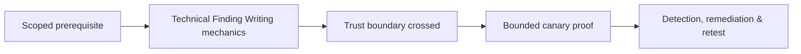

# Technical Finding Writing

A finding connects condition, evidence, prerequisites, impact, root cause, remediation, and retest.



Use a precise title, affected assets, severity/vector, description, steps, sanitized evidence, business impact, likelihood, detection opportunities, remediation priority, references, and validation steps. Separate facts from inference.

```text
Expected: tenant B receives 403 for tenant A canary invoice
Observed: 200 with canary metadata
Root cause: object lookup lacks tenant predicate
Fix: tenant-bound repository query plus authorization tests
```

Avoid payload-only reports, exaggerated impact, generic remediation, or screenshots without raw context. Mastery lab: rewrite five poor scanner findings into reproducible engineering tickets.

## Finding anatomy

A defensible finding contains affected assets and versions, prerequisite identity, violated security invariant, reproducible steps, observed and expected result, minimum proof, business impact, likelihood factors, root cause, compensating controls, remediation, detection opportunity, cleanup, and retest criteria. Separate confirmed fact from inference.

```text
Invariant: a tenant may read only objects it owns
Observed: Tenant A test user received Tenant B canary metadata
Root cause: object lookup omitted tenant predicate in export worker
Impact ceiling: cross-tenant confidentiality loss
Closure: centralized predicate covers synchronous and queued exports
```

Lead with the condition and consequence, not the tool or payload. Include enough sanitized request and response detail for an engineer to reproduce the issue. Recommendations should name the control layer and verification method; “sanitize input” or “apply least privilege” is not actionable. Record environmental constraints and failed variants so severity is not exaggerated.

---
> 🔼 Up: [[Reporting & Purple Teaming]]

## Core Concept

**Technical Finding Writing** is the atomic learning objective of this note. Identify its trust boundary, prerequisites, attacker-controlled input or state, vulnerable transformation, violated security invariant, minimum evidence, business consequence, and safe stopping point. The mechanism must remain explainable without depending on a specific product.

## Visual Attack Flow



## Practical Payloads & Execution

```text
engagement_action=Technical Finding Writing
asset=C2R-CANARY
identity=authorized-test-principal
impact_ceiling=single synthetic proof
```

### Expected output

```text
expected_output=C2R_CANARY_PROOF
cleanup=verified
retest_condition=recorded
```

Treat the output as proof of only the stated condition. Repeat with a negative control, preserve timestamps and the affected build, and never expand impact merely because another path appears reachable.

## Real-World Scenario

A regulated enterprise assessment applies **Technical Finding Writing** to a canary asset. Scope, evidence provenance, decision points, control outcomes, cleanup, ownership, and retest criteria are recorded so another qualified operator can reproduce the conclusion.

The durable remediation belongs at the authoritative enforcement layer. Retest the original condition and meaningful variants while verifying legitimate workflows still function.
