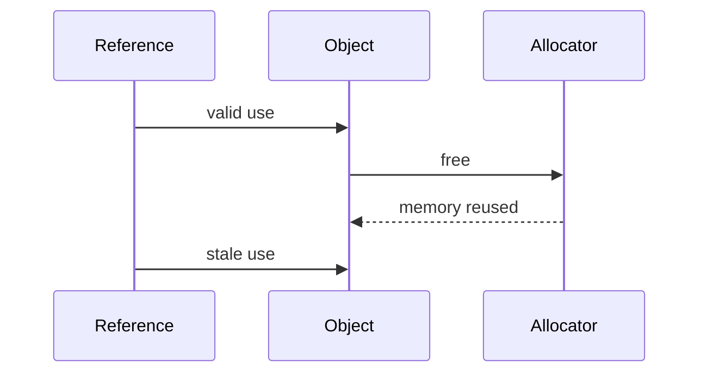
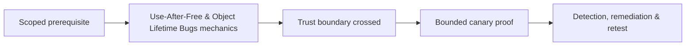

# Use-After-Free & Object Lifetime Bugs

Use-after-free occurs when a reference outlives its object. Dangling pointers, stale callbacks, race-driven lifetime errors, iterator invalidation, and cross-thread ownership can expose reused memory.



Assess lifetime graph, free path, stale reference, reallocation control, object type confusion, thread ordering, and mitigations such as quarantine, pointer authentication, reference counting, and memory-safe components.

Mastery lab: trigger deterministic single-thread and race UAF fixtures under ASan/TSan, minimize them, and repair ownership with RAII or explicit lifetime protocol.

## Lifetime analysis

Draw ownership and borrowing explicitly. Identify allocation, reference copies, callbacks, queues, cancellation, destruction, and every thread that can alter lifetime. Reproduce the simplest single-thread stale use before investigating allocator reuse or race windows.

```text
T1: register callback(object*)
T2: cancel request → free(object)
T1: queued callback → dereference stale object
```

Determine whether the stale access is read-only, writable, virtual dispatch, function callback, or size-bearing data. Then ask whether controlled reallocation can occupy the slot and whether quarantine, memory tagging, pointer authentication, or type isolation prevents reuse. Repair with a clear ownership model: RAII, reference-counted handles with cycle strategy, generation counters, cancellation synchronization, or copying immutable data into the callback. Add a regression that controls thread ordering so the original lifetime violation remains testable.

---
> 🔼 Up: [[Memory Corruption Exploitation]]

## Core Concept

**Use-After-Free & Object Lifetime Bugs** is the atomic learning objective of this note. Identify its trust boundary, prerequisites, attacker-controlled input or state, vulnerable transformation, violated security invariant, minimum evidence, business consequence, and safe stopping point. The mechanism must remain explainable without depending on a specific product.

## Visual Attack Flow



## Practical Payloads & Execution

```text
fixture=Use-After-Free & Object Lifetime Bugs
build=instrumented-debug
action=trigger minimized canary input
impact_ceiling=fixed marker or deterministic crash
```

### Expected output

```text
result=C2R_CANARY_PROOF
mitigation_state=recorded
production_boundary_crossed=false
```

Treat the output as proof of only the stated condition. Repeat with a negative control, preserve timestamps and the affected build, and never expand impact merely because another path appears reachable.

## Real-World Scenario

A vendor-owned instrumented build reproduces **Use-After-Free & Object Lifetime Bugs**. The researcher demonstrates only a fixed marker or deterministic crash, records architecture and mitigation assumptions, patches the root defect, and retains the minimized input as a regression test.

The durable remediation belongs at the authoritative enforcement layer. Retest the original condition and meaningful variants while verifying legitimate workflows still function.
