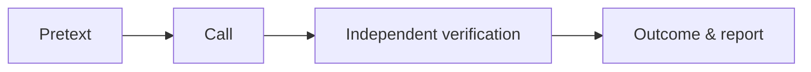
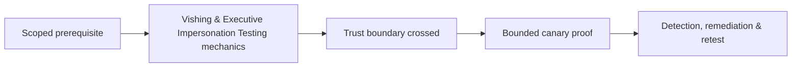

# Vishing & Executive Impersonation Testing

Voice exercises test callback verification, authority pressure, payment/data processes, caller-ID trust, escalation, recording, and reporting.



Use trained operators, approved scripts, canary transactions, prohibited topics, and immediate abort. Do not imitate distress or collect real secrets. Mastery lab: test one executive payment request and one vendor-change request, measuring process rather than individual blame.

## Voice-specific threat model

Caller ID, voice familiarity, job-title authority, conversational confidence, and knowledge of current events can create false trust. Synthetic voice technology increases plausibility but does not change the control requirement: sensitive actions must be verified through an independent, policy-approved channel.

Prepare a call card containing the exact claim, permitted responses, forbidden requests, escalation phrase, maximum duration, and abort conditions. The operator must never ask for a password, MFA code, real payment, private employee data, or remote-control installation.

```text
Claim: urgent supplier bank-detail correction
Canary: ticket FIN-TEST-204
Secure path: terminate call → dial known directory number → verify ticket owner
Pass: request refused or independently validated
Fail: workflow advances based only on inbound voice authority
```

Measure callback use, verification questions, supervisor escalation, ticket quality, fraud-team notification, and time to report. Debrief the process owner before participants, preserve aggregate results, and test remediation with a different script so memorized wording does not masquerade as resilience.

---
> 🔼 Up: [[Voice, Help Desk & Identity Verification]]

## Core Concept

**Vishing & Executive Impersonation Testing** is the atomic learning objective of this note. Identify its trust boundary, prerequisites, attacker-controlled input or state, vulnerable transformation, violated security invariant, minimum evidence, business consequence, and safe stopping point. The mechanism must remain explainable without depending on a specific product.

## Visual Attack Flow



## Practical Payloads & Execution

```text
exercise=Vishing & Executive Impersonation Testing
cohort=privacy-approved canary group
maximum_action=harmless marker
real_credentials_collected=false
```

### Expected output

```text
prevented_or_reported=true
participant_harm=none
control_owner=identified
```

Treat the output as proof of only the stated condition. Repeat with a negative control, preserve timestamps and the affected build, and never expand impact merely because another path appears reachable.

## Real-World Scenario

A privacy-approved enterprise exercise applies **Vishing & Executive Impersonation Testing** with synthetic identities and a harmless canary action. Legal, HR, privacy, and the white team define prohibited themes and stop conditions; results measure process and control performance rather than individuals.

The durable remediation belongs at the authoritative enforcement layer. Retest the original condition and meaningful variants while verifying legitimate workflows still function.
