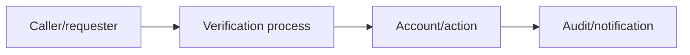

# Voice, Help Desk & Identity Verification

## 🗺️ Zero-to-Mastery Learning Path

1. [[Help Desk Identity Verification]]
2. [[MFA Recovery Process Testing]]
3. [[Vishing & Executive Impersonation Testing]]

---
> 🔼 Up: [[Social Engineering]]
