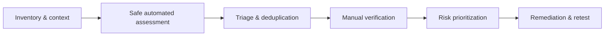

# Vulnerability Assessment

> [!abstract] Lifecycle branch
> Convert asset and service observations into verified, prioritized, reproducible security findings without treating scanner output as truth.

## 🗺️ Zero-to-Mastery Learning Path

1. [[CVE Intelligence]]
2. [[CWE Weakness Taxonomy]]
3. [[CVSS Technical Severity]]
4. [[EPSS Exploitation Probability]]
5. [[Vulnerability Scanning & Automation]]
6. [[Vulnerability Triage & False Positive Analysis]]
7. [[Manual Vulnerability Verification]]
8. [[Continuous Exposure & Remediation Validation]]

---
> 🔼 Up: [[Penetration Testing]]
