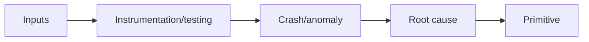

# Vulnerability Discovery & Debugging

```mermaid
flowchart LR
    I["Inputs"] --> T["Instrumentation/testing"]
    T --> C["Crash/anomaly"]
    C --> R["Root cause"]
    R --> P["Primitive"]
```

## 🗺️ Zero-to-Mastery Learning Path

1. [[Debugging & Crash Triage]]
2. [[Fuzzing & Vulnerability Discovery]]

---
> 🔼 Up: [[Exploit Development]]
