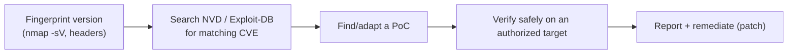

# 🔬 2.8 Vulnerability Research Masterclass

> [!abstract] The Masterclass
> Vulnerability research is the discipline of *finding, classifying, scoring, and weaponising* weaknesses — the bridge between "I found a service" and "here is a working exploit." This chapter covers the vocabulary, the vulnerability classes, severity scoring (CVSS/VPR), and the databases and offline tooling you use to turn a version number into an exploit. **`#level/apprentice` → `#level/operator`**

> [!warning] Authorized Simulation context
> Vulnerability research here supports **authorized assessment and defensive testing** — knowing what's exploitable so you can prioritise patching. Weaponised exploits are only ever run against in-scope systems.

> [!tip] Chapter Map
> **** · **** · ****

---

## Vulnerability Fundamentals

Three terms, precisely:

| Term | Definition |
| --- | --- |
| **Vulnerability** | A weakness or flaw in the design, implementation, or behaviour of a system or application. |
| **Exploit** | An action, code, or technique that *uses* a vulnerability to violate the system's security. |
| **Proof of Concept (PoC)** | A minimal artifact that *demonstrates* a vulnerability is real and exploitable. |

### The five vulnerability classes
| Class | Description & example |
| --- | --- |
| **Operating System** | Flaws in the OS itself — often yield **Privilege Escalation** (e.g. a kernel LPE). |
| **(Mis)Configuration** | A correctly-built app set up insecurely — e.g. a site exposing customer data (**A05**). |
| **Weak/Default Credentials** | Shipped defaults left unchanged (`admin/admin`) — trivial to guess (**A07**). |
| **Application Logic** | Poor design — e.g. a broken auth flow letting you impersonate a user (**Authentication Bypass**). |
| **Human-Factor** | Exploits human behaviour — e.g. **phishing**. |



---

## Scoring — CVSS and VPR

Not all findings are equal; scoring drives prioritisation.

- **CVSS (Common Vulnerability Scoring System)** — a **static** 0–10 severity score based on intrinsic characteristics (attack vector, complexity, privileges required, impact to confidentiality/integrity/availability). A `9.8` is remotely exploitable, no auth, full impact. It doesn't change over time.
- **VPR (Vulnerability Priority Rating)** — a **dynamic** score weighting the *real-world likelihood* of exploitation (active exploit code, threat-intel chatter). It changes as the threat landscape does — a medium-CVSS bug with a fresh public exploit can outrank a high-CVSS one nobody is using.

> Use CVSS to understand *how bad it could be*, VPR (or CISA's KEV catalogue) to understand *what's actually being exploited right now* — patch the intersection first.

---

## Vulnerability Databases and Searchsploit

Once you've fingerprinted software + version (via **nmap -sV** or response headers), look it up:

- **[NVD (National Vulnerability Database)](https://nvd.nist.gov/vuln)** — NIST's authoritative CVE feed with CVSS scores.
- **[Exploit-DB](https://www.exploit-db.com/)** — a huge archive of public exploits and PoCs, CVE-cross-referenced.
- **CISA KEV** — the "known exploited vulnerabilities" catalogue: patch these first.

**Searchsploit** is an **offline** copy of Exploit-DB bundled with Kali — search without touching the internet:
```bash
searchsploit wordpress 5.8            # find exploits for a specific product/version
searchsploit -m php/webapps/50123.py  # mirror (copy) an exploit locally to inspect/adapt
searchsploit -x 50123                 # examine an exploit in the pager
searchsploit --nmap scan.xml          # feed an nmap XML scan → suggested exploits
```
```shell-session
kali@kali:~$ searchsploit apache 2.4.49
------------------------------------------------- ----------------------------
 Exploit Title                                    |  Path
------------------------------------------------- ----------------------------
 Apache 2.4.49 - Path Traversal & RCE (CVE-...)   | multiple/webapps/50383.sh
------------------------------------------------- ----------------------------
```
> [!warning] Always read before you run
> Public PoCs can be buggy, destructive, or backdoored. Read the code, understand it, and only run it against an **authorized** target. This feeds the Phase 3 **Privilege Escalation** and exploit-development work.

---

## 🔗 Related Master Notes & Deep-Dives
- **OWASP Top 10 (A06 Vulnerable and Outdated Components)** — the web angle on outdated software
- **2.6 Network Attacks and Recon** — fingerprinting that precedes lookup
- **2.5 Tooling** · **Privilege Escalation** — weaponising a finding
- [[Recon & Social Engineering]] — domain hub
