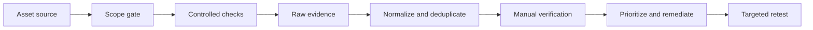

# Vulnerability Scanning & Automation

> [!abstract] Methodology
> Automated assessment applies repeatable checks across an attack surface to generate vulnerability hypotheses. This chapter explains scanner reasoning, coverage, authenticated versus external viewpoints, confidence, safety, normalization, prioritization, and business integration. Product setup and command syntax belong in the Tooling Armory.

## Why automate

Humans excel at context, chaining, and business logic; automation excels at repetition and scale. A mature program uses automation to:

- Discover common missing patches and unsafe configurations consistently.
- Measure coverage across large and changing inventories.
- Detect recurrence and drift.
- Prioritize manual attention.
- Produce comparable evidence over time.

Automation cannot prove every exploit path. It often lacks business context, authenticated state, code-flow understanding, and awareness of compensating controls.

## Detection models

Scanner checks generally rely on one or more models:

| Model | Evidence | Typical weakness |
|---|---|---|
| Banner/version correlation | Exposed product/version string | Backports, proxies, modified banners |
| Protocol behavior | Response to a crafted but safe request | Ambiguous products and controls |
| Authenticated inventory | Installed package, patch, registry, policy | Credential failure or incomplete privilege |
| Configuration audit | Local setting compared with baseline | Intent and compensating controls absent |
| Template/signature | Deterministic request and matcher | Over-broad matching and environmental variance |
| Agent telemetry | Local inventory collected continuously | Agent coverage and backend trust |

The report must identify the detection model. A generic version match carries less confidence than authenticated build evidence plus reproducible behavior.

## Authenticated and unauthenticated viewpoints

An external or unauthenticated assessment answers: *What can this network position reach and infer?* It measures exposed services, protocol behavior, encryption, and remotely observable flaws.

An authenticated assessment answers: *What is installed and configured locally?* It can inspect package revisions, missing updates, policies, permissions, and software not currently listening.

Neither replaces the other. A host can be fully patched locally but expose an unsafe application configuration; a remote banner can look obsolete while the vendor has backported the fix.

Credentials should be dedicated, least-privileged, time-bounded, source-restricted, vaulted, rotated, and audited. The assessment must verify that authentication succeeded rather than assuming configured credentials were used.

## Scope as a safety control

The scanner target list should derive from the signed asset inventory, not ad hoc discovery. It must account for dynamic DNS, cloud/CDN ownership, shared hosting, excluded systems, and maintenance windows.

Separate policies for:

- Standard servers and workstations.
- Network and security appliances.
- Databases and middleware.
- Industrial, medical, embedded, and fragile systems.
- Web/API surfaces.
- Cloud control planes and ephemeral workloads.

One universal aggressive policy is operationally immature.

## Scan safety engineering

Establish measurable limits and stop conditions:

- Requests or packets per second.
- Concurrent hosts and checks per host.
- Authentication attempts and lockout thresholds.
- CPU, memory, latency, and error-rate thresholds.
- Prohibited destructive, stress, fuzzing, and denial-of-service checks.
- Operations/SOC stop word and escalation channel.

Run a representative canary set first. Observe application health, endpoint load, authentication telemetry, firewall state, and SOC alerts before expanding in waves.

## Coverage and blind spots

Coverage has several dimensions:

```text
Asset coverage × port/service coverage × authenticated coverage
× check-family coverage × time/frequency × environment coverage
```

A "completed" scan may still have poor coverage because hosts were offline, credentials failed, virtual hosts were missing, cloud assets changed, templates were excluded, or a WAF prevented meaningful responses.

Report denominators: `837 of 1,024 assets scanned`, not merely `837 assets scanned`.

## Candidate-finding lifecycle



Raw results must remain immutable enough to reconstruct what the scanner observed. Preserve policy/version, check-feed revision, target/exclusion sets, credentials status, timing, source identity, warnings, and machine-readable output.

## Deduplication and root cause

Several checks may describe one weakness. Normalize by:

- Asset and service instance.
- Root cause rather than scanner title.
- CVE/CWE where appropriate.
- Detection method and evidence.
- Exposure and authentication state.
- First/last observed timestamps.
- Owner and remediation record.

Do not collapse separate vulnerable instances merely because they share a CVE. Do not inflate one root cause into multiple findings because several engines reported it.

## Severity versus priority

Technical severity is only one input. Business priority also depends on:

- Internet or trust-zone exposure.
- Exploit prerequisites and known exploitation.
- Asset criticality and data sensitivity.
- Reachability of subsequent systems.
- Existing detection and compensating controls.
- Recovery capability and operational impact of remediation.

An externally reachable identity flaw on a critical service may outrank a higher-scoring local issue on an isolated lab host.

## Continuous vulnerability management

Point-in-time scans decay as assets and threats change. A mature program integrates:

- Authoritative inventory and ownership.
- Scheduled and event-driven assessment.
- Patch and configuration management.
- Exception and accepted-risk workflows.
- Remediation service-level objectives.
- Targeted retesting and recurrence tracking.

Useful metrics include authenticated coverage, false-positive rate, mean time to verify, remediation age, recurrence, exposure window, and risk accepted past expiry. Raw finding count is not a security outcome.

## Human review gates

Automation should never directly become a critical report without review. A verifier asks:

1. Is the asset and service identity correct?
2. Is the affected product/build truly present?
3. Did the relevant check authenticate?
4. Are the required feature and configuration enabled?
5. Is the vulnerable path reachable from the threat position?
6. Is the condition reproducible safely?
7. What business process or data is affected?

At root level, automated scanning is controlled instrumentation. Its quality is measured by reproducibility, coverage, confidence, safe operation, and how effectively it drives verified remediation—not by the number of red rows it generates.

---
> 🔼 Up: [[Network Penetration Testing]]
