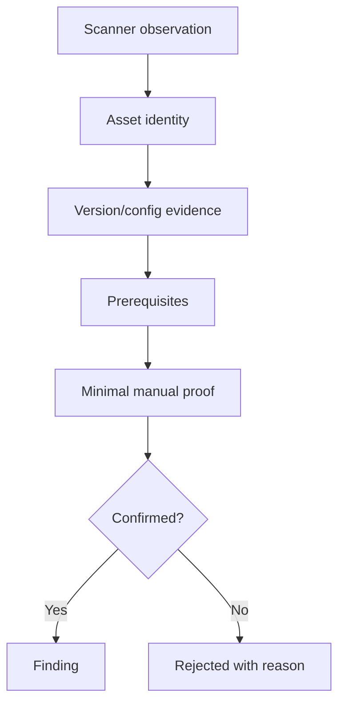
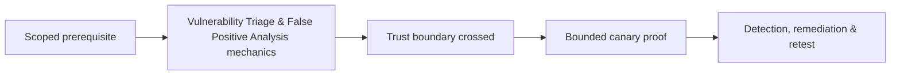

# Vulnerability Triage & False Positive Analysis

Triage turns noisy observations into confirmed findings, rejected hypotheses, duplicates, accepted risks, and coverage gaps.



Common false positives arise from backported patches, proxies, deceptive banners, shared IPs, stale inventories, unreachable authenticated checks, version ranges, disabled code paths, or response-pattern collisions. Common false negatives arise from failed credentials, excluded ports, encrypted/custom protocols, ephemeral assets, and missing application context.

```text
Observation: package version appears below fixed release
Host evidence: vendor backport advisory + installed changelog
Manual proof: vulnerable behavior absent in controlled test
Disposition: false positive—backported patch
Action: add vendor-aware validation; do not suppress globally
```

Track who triaged, evidence, confidence, disposition, expiry, and retest trigger. Mastery lab: classify a mixed set containing confirmed, backported, duplicate, inaccessible, and compensating-control cases.

---
> 🔼 Up: [[Vulnerability Assessment]]

## Core Concept

**Vulnerability Triage & False Positive Analysis** is the atomic learning objective of this note. Identify its trust boundary, prerequisites, attacker-controlled input or state, vulnerable transformation, violated security invariant, minimum evidence, business consequence, and safe stopping point. The mechanism must remain explainable without depending on a specific product.

## Visual Attack Flow



## Practical Payloads & Execution

```text
target=198.51.100.20 or designated enterprise canary
identity=assessment-user
action=Vulnerability Triage & False Positive Analysis
rate_and_scope=approved
```

### Expected output

```text
observable_result=C2R_CANARY_PROOF
unauthorized_targets=0
evidence_timestamp=recorded
```

Treat the output as proof of only the stated condition. Repeat with a negative control, preserve timestamps and the affected build, and never expand impact merely because another path appears reachable.

## Real-World Scenario

A scoped enterprise infrastructure assessment applies **Vulnerability Triage & False Positive Analysis** only to documentation-range addresses and designated canary services. Activity is rate-limited, ownership is verified, protocol evidence is captured, and broad exploitation is explicitly avoided.

The durable remediation belongs at the authoritative enforcement layer. Retest the original condition and meaningful variants while verifying legitimate workflows still function.
