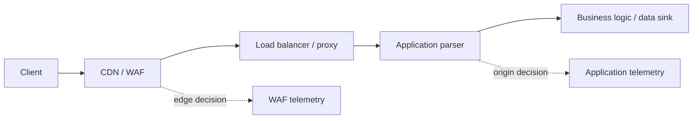
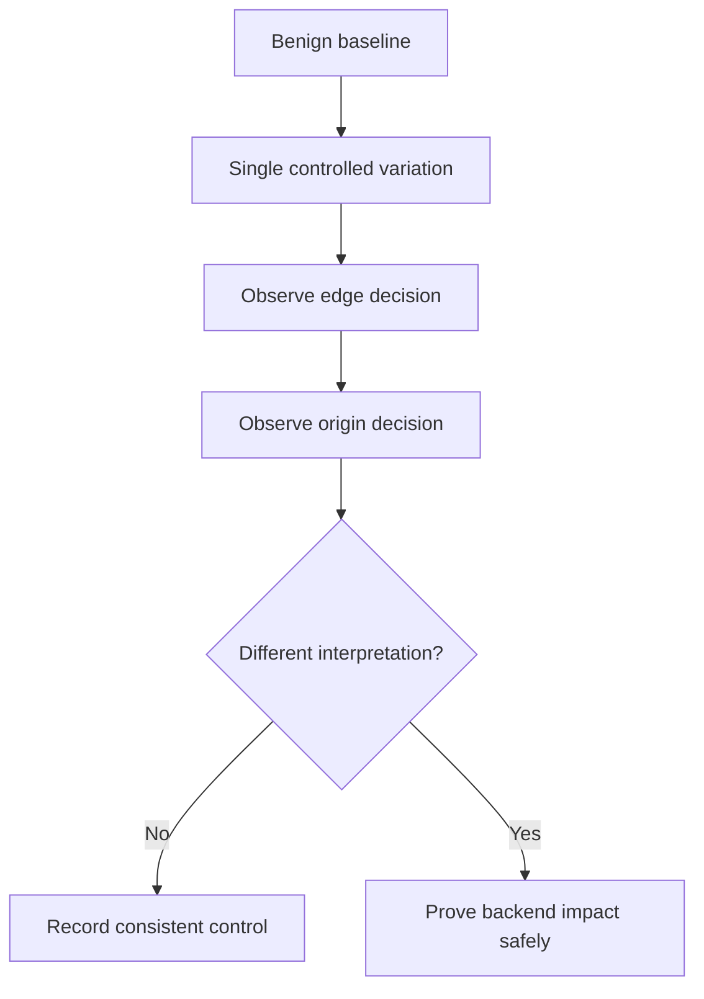

# WAF Testing & Bypass Methodology

> [!abstract] Authorized control validation
> A WAF is a parsing and policy layer, not a substitute for secure application code. Testing asks whether edge and origin interpret the same request, whether policy is consistent across routes and protocols, and whether bypasses expose a real backend weakness.

## Request-path architecture



Bypasses arise when these layers normalize differently.

## Establish a baseline

Use a harmless marker to characterize normal, suspicious, and blocked requests:

```http
GET /search?q=alpha HTTP/1.1
Host: app.example.com

HTTP/1.1 200 OK
X-Request-ID: edge-7f91
```

Record status, body hash/length, cache behavior, edge headers, request ID, latency, origin logs, and whether the application processed the request.

## Canonicalization mismatches

Test one transformation at a time using non-destructive markers:

- Percent encoding and double encoding.
- Case folding and Unicode normalization.
- Repeated parameters and conflicting values.
- Path dot-segments, duplicate slashes, semicolons, and encoded separators.
- JSON number/string/array/object type changes.
- Content-type disagreement and multipart boundaries.
- Duplicate or folded headers.
- Transfer framing differences between HTTP versions and proxies.

Example parameter ambiguity:

```http
GET /account?role=user&role=admin HTTP/1.1
Host: app.example.com
```

The finding is not "WAF bypass" until the edge and origin choose different values *and* the backend behavior violates a security control.

## Route and protocol consistency

Compare:

| Variant | Expected result |
|---|---|
| Public hostname | WAF policy applied |
| Alternate hostname | Same policy and identity |
| Direct origin | Denied or restricted |
| IPv4 and IPv6 | Equivalent filtering |
| HTTP/1.1 and HTTP/2 | Equivalent normalization |
| REST, GraphQL, WebSocket upgrade | Appropriate protocol-specific policy |
| Encoded and decoded paths | Same canonical resource decision |

An exposed origin is an architecture finding even if the WAF itself parses correctly.

## Differential workflow



Avoid large payload lists. Minimal transformations make the root cause understandable and reduce production risk.

## Safe proof and output

```text
Baseline request ID: edge-7f91 → origin-2ab4
Variant: duplicate JSON key with conflicting synthetic role value
Edge: allowed
Origin: selected last key
Impact proof: test account viewed a canary admin-only label
No real data accessed; test state removed
```

## Defensive outcomes

- Canonicalize once before policy and application processing.
- Reject ambiguous duplicate headers/parameters.
- Enforce access control in application code.
- Restrict origin reachability to trusted edge networks.
- Keep protocol policies aligned and regression-tested.
- Correlate edge and origin request IDs.

---
> 🔼 Up: [[Web Application Penetration Testing]]
