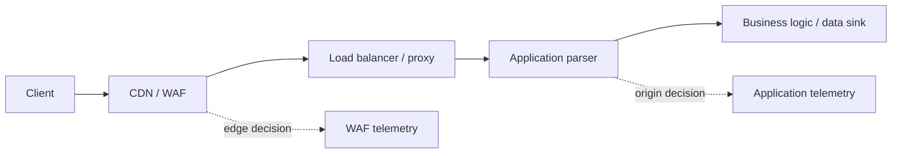
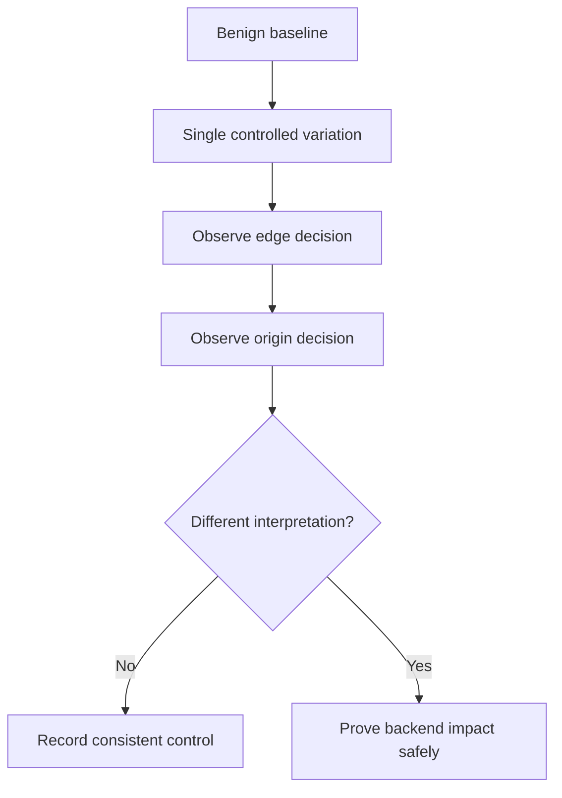
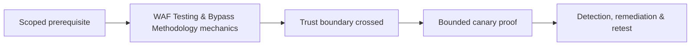

# WAF Testing & Bypass Methodology

> [!abstract] Authorized control validation
> A WAF is a parsing and policy layer, not a substitute for secure application code. Testing asks whether edge and origin interpret the same request, whether policy is consistent across routes and protocols, and whether bypasses expose a real backend weakness.

## Request-path architecture



Bypasses arise when these layers normalize differently.

## Establish a baseline

Use a harmless marker to characterize normal, suspicious, and blocked requests:

```http
GET /search?q=alpha HTTP/1.1
Host: app.example.com

HTTP/1.1 200 OK
X-Request-ID: edge-7f91
```

Record status, body hash/length, cache behavior, edge headers, request ID, latency, origin logs, and whether the application processed the request.

## Canonicalization mismatches

Test one transformation at a time using non-destructive markers:

- Percent encoding and double encoding.
- Case folding and Unicode normalization.
- Repeated parameters and conflicting values.
- Path dot-segments, duplicate slashes, semicolons, and encoded separators.
- JSON number/string/array/object type changes.
- Content-type disagreement and multipart boundaries.
- Duplicate or folded headers.
- Transfer framing differences between HTTP versions and proxies.

Example parameter ambiguity:

```http
GET /account?role=user&role=admin HTTP/1.1
Host: app.example.com
```

The finding is not "WAF bypass" until the edge and origin choose different values *and* the backend behavior violates a security control.

## Route and protocol consistency

Compare:

| Variant | Expected result |
|---|---|
| Public hostname | WAF policy applied |
| Alternate hostname | Same policy and identity |
| Direct origin | Denied or restricted |
| IPv4 and IPv6 | Equivalent filtering |
| HTTP/1.1 and HTTP/2 | Equivalent normalization |
| REST, GraphQL, WebSocket upgrade | Appropriate protocol-specific policy |
| Encoded and decoded paths | Same canonical resource decision |

An exposed origin is an architecture finding even if the WAF itself parses correctly.

## Differential workflow



Avoid large payload lists. Minimal transformations make the root cause understandable and reduce production risk.

## Safe proof and output

```text
Baseline request ID: edge-7f91 → origin-2ab4
Variant: duplicate JSON key with conflicting synthetic role value
Edge: allowed
Origin: selected last key
Impact proof: test account viewed a canary admin-only label
No real data accessed; test state removed
```

## Defensive outcomes

- Canonicalize once before policy and application processing.
- Reject ambiguous duplicate headers/parameters.
- Enforce access control in application code.
- Restrict origin reachability to trusted edge networks.
- Keep protocol policies aligned and regression-tested.
- Correlate edge and origin request IDs.

## Normalization differential matrix

Test one transformation at a time across browser, edge, gateway, framework, and application:

| Dimension | Controlled variants |
|---|---|
| Path | duplicate slash, dot segment, percent encoding, case |
| Query | duplicate key, empty value, separator, encoding |
| Body | form, JSON, XML, multipart, charset |
| Headers | duplicates, case, whitespace, forwarding headers |
| Method | GET/POST equivalents, override headers where supported |
| Protocol | HTTP/1.1 vs HTTP/2 behavior through approved clients |

Capture edge request ID, origin request ID, response status/length/title, latency, cache status, and backend side effect. A difference is a hypothesis until origin behavior is proven.

## Safe bypass proof

Use a non-destructive canary that the origin recognizes but the WAF policy is expected to block. The proof is not “a payload got through”; it is that semantically equivalent requests receive inconsistent enforcement and reach the same controlled sink.

```text
Control: canonical request -> blocked at edge, origin marker absent
Variant: alternate encoding -> 200, origin marker present
Impact: normalization mismatch permits prohibited input class
Cleanup: no persistent state; canary logs retained
```

## Defense validation

Recommend canonicalization at one trusted boundary, consistent parser chains, schema validation, positive security controls, virtual patch testing, and origin-side secure coding. WAF tuning must include regression fixtures for canonical and bypass variants, false-positive traffic, performance, and logging.

## Mastery lab

Place a test application behind two differently configured proxies. Build a normalization matrix, predict parsing at each layer, capture both sides, explain three differentials, fix configuration/application validation, and retest all variants. Include cache and request-ID correlation.

---
> 🔼 Up: [[HTTP Architecture & Advanced Web Attacks]]

## Core Concept

**WAF Testing & Bypass Methodology** is the atomic learning objective of this note. Identify its trust boundary, prerequisites, attacker-controlled input or state, vulnerable transformation, violated security invariant, minimum evidence, business consequence, and safe stopping point. The mechanism must remain explainable without depending on a specific product.

## Visual Attack Flow



## Practical Payloads & Execution

```http
POST /c2r-lab/waf-testing-bypass-methodology HTTP/1.1
Host: app.example.test
Authorization: Bearer <CANARY_IDENTITY>
Content-Type: application/json

{"object":"C2R-CANARY","test":true}
```

### Expected output

```text
HTTP/1.1 200 OK
X-C2R-Result: vulnerable-condition-observed
{"marker":"C2R-CANARY-PROOF"}
```

Treat the output as proof of only the stated condition. Repeat with a negative control, preserve timestamps and the affected build, and never expand impact merely because another path appears reachable.

## Real-World Scenario

A multi-tenant enterprise service exposes a scoped **WAF Testing & Bypass Methodology** condition to a synthetic customer account. The assessor proves one trust-boundary failure with a canary object, correlates application and identity telemetry, removes test state, and assigns the authoritative server-side control.

The durable remediation belongs at the authoritative enforcement layer. Retest the original condition and meaningful variants while verifying legitimate workflows still function.
