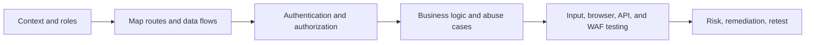

# Web Application Penetration Testing

> [!abstract] Lifecycle branch
> Enterprise web assessment across attack-surface mapping, OWASP-aligned coverage, authentication and authorization, business workflows, input handling, edge controls, APIs, evidence, and retesting.



## 🗺️ Zero-to-Mastery Learning Path

1. [[OWASP Web Testing Methodology]]
2. [[Web Identity & Access Control]]
3. [[Web Injection Testing]]
4. [[Client-Side Web Security]]
5. [[HTTP Architecture & Advanced Web Attacks]]
6. [[File, Parser & Serialization Security]]
7. [[Business Logic & Workflow Security]]
8. [[CMS & Framework Security Testing]]

## Practical artifact

```text
Role matrix: anonymous / customer / manager / administrator
Critical workflows: signup, login, checkout, refund, export, support
Data classes: public, internal, personal, financial, secrets
State-changing routes: mapped and protected from accidental execution
```

---
> 🔼 Up: [[Penetration Testing]]
