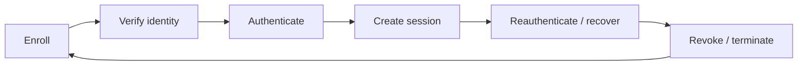
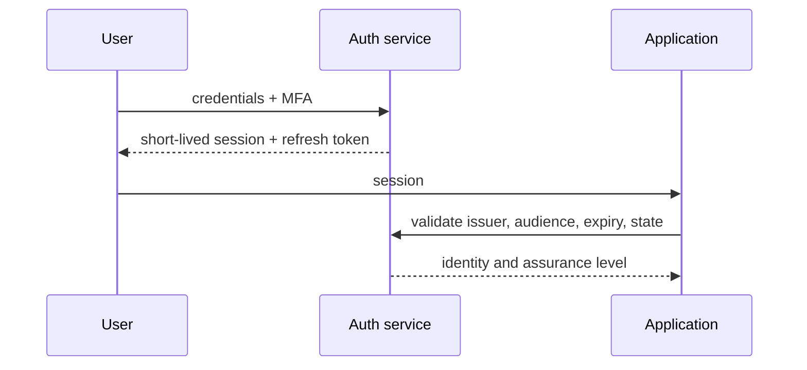
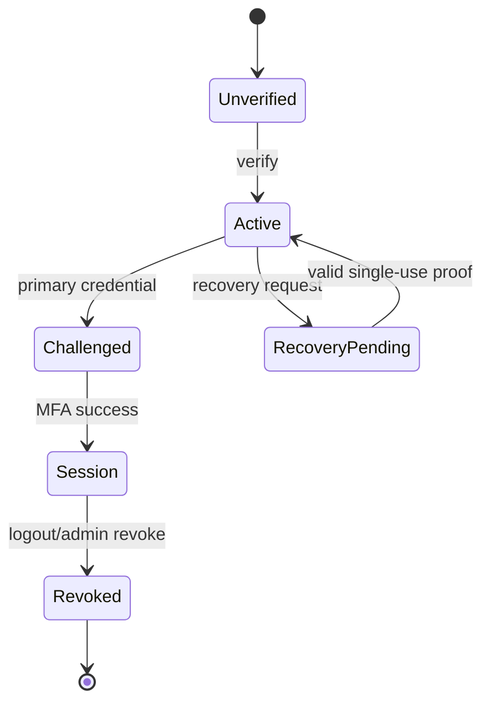
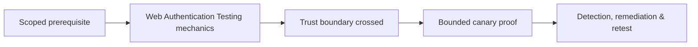

# Web Authentication Testing

> [!abstract] Enterprise methodology
> Authentication testing evaluates account lifecycle, credential verification, MFA, federation, session management, recovery, reauthentication, and abuse resistance. The objective is to prove whether an attacker can become or remain another identity—not merely whether a login form rejects one password.

## Identity lifecycle



Test every transition and alternate channel: web, mobile, API, SSO, support desk, invitation, recovery, and device enrollment.

## Enumeration and credential controls

Compare valid and invalid identities across status, body, timing, headers, and side effects:

```http
POST /login HTTP/1.1
Content-Type: application/json

{"email":"known-test@example.com","password":"incorrect-test-value"}

HTTP/1.1 401 Unauthorized
{"error":"Invalid credentials"}
```

Responses should not reveal whether the account exists. Check signup, recovery, invitation, MFA enrollment, and support workflows—not just login.

Rate limiting must consider account, source, device, network, credential pair, and distributed patterns. Use synthetic accounts, agreed request ceilings, and lockout monitoring.

## MFA testing

Verify:

- MFA applies to every login and sensitive action.
- Recovery cannot downgrade assurance silently.
- Backup codes are one-time, protected, and revocable.
- New device enrollment requires existing high-assurance proof.
- Remember-device tokens are scoped, expiring, and invalidated.
- Push workflows resist fatigue and show transaction context.
- Federation and legacy protocols cannot bypass MFA.

Representative state flaw:

```text
1. Test account completes password step → temporary session S1
2. Before MFA, S1 requests /account/export
Expected: 401 or MFA-required
Actual:   200 with synthetic account export
```

## Session management

Inspect cookie/token properties, rotation, logout, concurrency, fixation, idle/absolute timeout, audience, issuer, and revocation.

```http
Set-Cookie: session=<opaque>; Secure; HttpOnly; SameSite=Lax; Path=/
```

After login or privilege change, the session identifier should rotate. After password reset, account disablement, or logout, relevant sessions and refresh tokens should be invalidated.



## Federation

For OAuth/OIDC and SAML, verify redirect allowlists, state/nonce binding, issuer/audience, signature validation, key selection, code replay resistance, PKCE, account linking, and logout. Use a client-controlled identity provider or test tenant; never tamper with production users.

## Password reset and account recovery

Assess token entropy, single use, expiry, channel security, identity proof, session invalidation, notification, and support overrides. A secure login can be defeated by a weak help-desk reset process.

## Evidence

```text
Test identity: auth-test-02
Assurance expected: password + phishing-resistant MFA
Path tested: legacy mobile API
Actual: password-only token accepted by web API
Impact: MFA bypass for any known credential
Cleanup: token revoked; account reset
```

Remediation should unify policy at the identity service, enforce assurance level server-side, remove legacy exceptions, and add detection for unusual enrollment, recovery, and token use.

## Authentication state machine

Model registration, verification, login, challenge, MFA enrollment, trusted device, recovery, password change, logout, revocation, account disablement, and federation linking. Security defects often occur between states rather than inside the password form.



## Session analysis

Inspect cookie `Secure`, `HttpOnly`, `SameSite`, scope, expiry, rotation, concurrent sessions, idle/absolute timeout, refresh tokens, logout revocation, password/MFA-change invalidation, and server-side device records. Compare token before/after every privilege transition.

## Federation & recovery

For OAuth/OIDC/SAML, validate exact redirect registration, state/nonce, PKCE where applicable, issuer/audience, signature/key selection, claim mapping, account linking, and logout. For recovery, test enumeration resistance, token entropy, expiry, one-time use, identity binding, rate controls, and session invalidation.

## Mastery lab

Use test identities to traverse every state. Record request/response and token hash transitions, test a stale recovery token, role change, MFA reset, concurrent session, and logout from another device. Confirm identity telemetry and notifications. Do not brute-force real accounts.

## Failure analysis

A uniform UI response can still leak timing or delivery behavior. A rotated browser cookie may leave API refresh tokens active. MFA on login may not protect recovery or sensitive actions. Federation can authenticate correctly but map an unsafe role. Report the weakest complete path to account control.

---
> 🔼 Up: [[Web Identity & Access Control]]

## Core Concept

**Web Authentication Testing** is the atomic learning objective of this note. Identify its trust boundary, prerequisites, attacker-controlled input or state, vulnerable transformation, violated security invariant, minimum evidence, business consequence, and safe stopping point. The mechanism must remain explainable without depending on a specific product.

## Visual Attack Flow



## Practical Payloads & Execution

```http
POST /c2r-lab/web-authentication-testing HTTP/1.1
Host: app.example.test
Authorization: Bearer <CANARY_IDENTITY>
Content-Type: application/json

{"object":"C2R-CANARY","test":true}
```

### Expected output

```text
HTTP/1.1 200 OK
X-C2R-Result: vulnerable-condition-observed
{"marker":"C2R-CANARY-PROOF"}
```

Treat the output as proof of only the stated condition. Repeat with a negative control, preserve timestamps and the affected build, and never expand impact merely because another path appears reachable.

## Real-World Scenario

A multi-tenant enterprise service exposes a scoped **Web Authentication Testing** condition to a synthetic customer account. The assessor proves one trust-boundary failure with a canary object, correlates application and identity telemetry, removes test state, and assigns the authoritative server-side control.

The durable remediation belongs at the authoritative enforcement layer. Retest the original condition and meaningful variants while verifying legitimate workflows still function.
