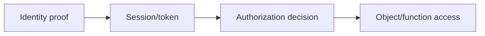

# Web Identity & Access Control

## 🗺️ Zero-to-Mastery Learning Path

1. [[Web Authentication Testing]]
2. [[JWT Security Testing]]
3. [[OAuth 2.0 & OpenID Connect Testing]]
4. [[SAML Security Testing]]
5. [[MFA, Recovery & Session Bypass Testing]]
6. [[IDOR Testing]]
7. [[BOLA Testing]]
8. [[BFLA Testing]]

---
> 🔼 Up: [[Web Application Penetration Testing]]
