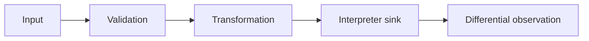

# Web Injection Testing

Injection occurs when untrusted data changes the grammar or semantics of an interpreter. Testing must trace input through transformations to a specific sink.

## 🗺️ Zero-to-Mastery Learning Path

1. [[SQL Injection]]
2. [[NoSQL Injection]]
3. [[ORM Injection]]
4. [[Operating System Command Injection]]
5. [[Server-Side Template Injection]]
6. [[LDAP Injection]]
7. [[XPath Injection]]
8. [[CRLF Injection]]
9. [[SSI Injection]]

---
> 🔼 Up: [[Web Application Penetration Testing]]
