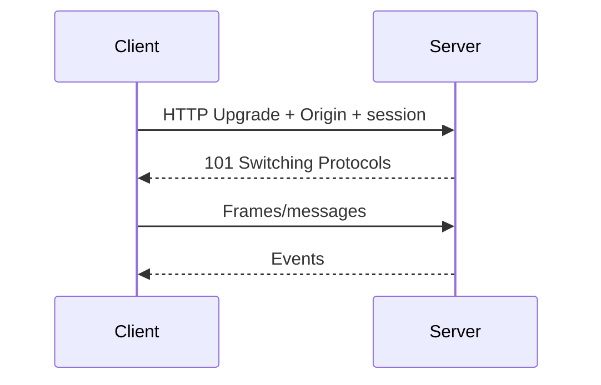
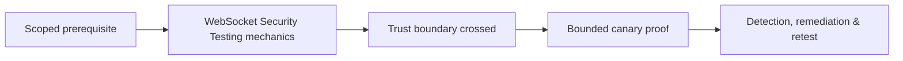

# WebSocket Security Testing

WebSockets upgrade HTTP into a long-lived bidirectional channel. Security covers handshake origin/authentication, session lifecycle, message authorization, parsing, state, and resource controls.



Test cross-site WebSocket hijacking, Origin policy, cookie/token binding, logout/revocation, channel/topic authorization, message schema, injection, binary frames, compression, fragmentation, oversized messages, subscription limits, replay, and reconnect behavior.

Use canary channels and stop before resource pressure. Remediate with strict Origin allowlists, explicit authentication, per-message authorization, schema validation, bounded sizes/rates/subscriptions, safe compression, and session revocation.

Mastery lab: test two tenants subscribing and publishing across authorized and forbidden channels, including logout and reconnect.

---
> 🔼 Up: [[API & Modern Protocol Testing]]

## Core Concept

**WebSocket Security Testing** is the atomic learning objective of this note. Identify its trust boundary, prerequisites, attacker-controlled input or state, vulnerable transformation, violated security invariant, minimum evidence, business consequence, and safe stopping point. The mechanism must remain explainable without depending on a specific product.

## Visual Attack Flow



## Practical Payloads & Execution

```http
POST /c2r-lab/websocket-security-testing HTTP/1.1
Host: app.example.test
Authorization: Bearer <CANARY_IDENTITY>
Content-Type: application/json

{"object":"C2R-CANARY","test":true}
```

### Expected output

```text
HTTP/1.1 200 OK
X-C2R-Result: vulnerable-condition-observed
{"marker":"C2R-CANARY-PROOF"}
```

Treat the output as proof of only the stated condition. Repeat with a negative control, preserve timestamps and the affected build, and never expand impact merely because another path appears reachable.

## Real-World Scenario

A multi-tenant enterprise service exposes a scoped **WebSocket Security Testing** condition to a synthetic customer account. The assessor proves one trust-boundary failure with a canary object, correlates application and identity telemetry, removes test state, and assigns the authoritative server-side control.

The durable remediation belongs at the authoritative enforcement layer. Retest the original condition and meaningful variants while verifying legitimate workflows still function.
