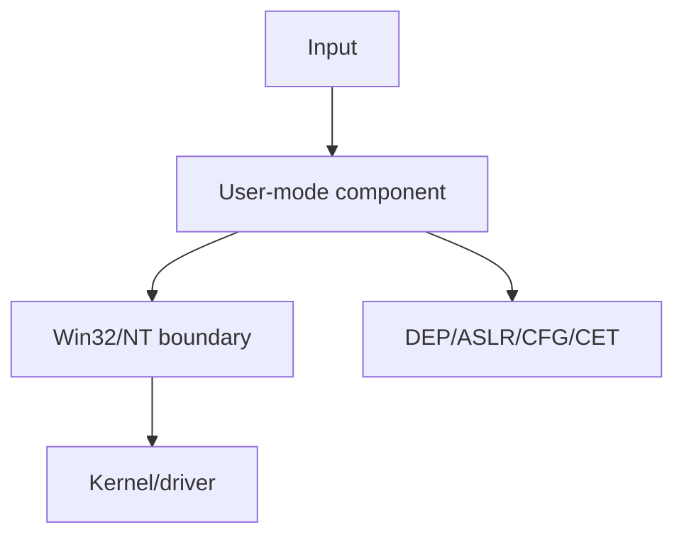
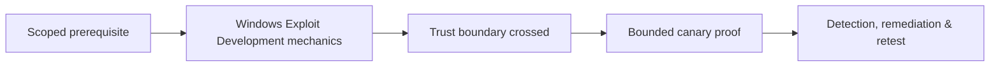

# Windows Exploit Development

Windows exploitation requires PE loading, x64 ABI, structured/unwind exception behavior, heaps, tokens, handles, object manager, user/kernel boundaries, and mitigations.



Use WinDbg and instrumented toy programs to analyze exceptions, modules, symbols, stacks, heaps, and mitigations. Historical SEH overwrite, DLL loading, and driver bugs should be reproduced only in disposable VMs.

Mastery lab: triage a user-mode crash with symbols, derive a canary control primitive, inspect mitigation state, and produce a patched build plus regression test.

## Windows-specific analysis

Capture OS build, architecture, process integrity, token, modules with timestamps and hashes, symbol path, exception record, thread contexts, heaps, and mitigation policy. The x64 ABI requires register arguments, shadow space, and stack alignment; unwind metadata affects exception and stack analysis.

```text
ExceptionCode: c0000005 (Access violation)
Operation: write
FaultAddress: 000001f4`41414141
ProcessMitigations: DEP=on ASLR=on CFG=on
```

Separate user-mode primitive from privilege impact. Handles, access tokens, object namespaces, service identity, AppContainer, protected processes, and broker boundaries determine reach. For drivers, use a disposable VM with snapshots and verifier instrumentation; kernel crashes are not acceptable production proofs. Patch the unsafe boundary, use compiler and platform mitigations, sign builds, and preserve a symbolized dump plus minimized regression input. Defender evidence includes application crashes, exploit-protection events, unusual memory permissions, handle access, and driver load telemetry.

---
> 🔼 Up: [[Platform Exploitation]]

## Core Concept

**Windows Exploit Development** is the atomic learning objective of this note. Identify its trust boundary, prerequisites, attacker-controlled input or state, vulnerable transformation, violated security invariant, minimum evidence, business consequence, and safe stopping point. The mechanism must remain explainable without depending on a specific product.

## Visual Attack Flow



## Practical Payloads & Execution

```text
fixture=Windows Exploit Development
build=instrumented-debug
action=trigger minimized canary input
impact_ceiling=fixed marker or deterministic crash
```

### Expected output

```text
result=C2R_CANARY_PROOF
mitigation_state=recorded
production_boundary_crossed=false
```

Treat the output as proof of only the stated condition. Repeat with a negative control, preserve timestamps and the affected build, and never expand impact merely because another path appears reachable.

## Real-World Scenario

A vendor-owned instrumented build reproduces **Windows Exploit Development**. The researcher demonstrates only a fixed marker or deterministic crash, records architecture and mitigation assumptions, patches the root defect, and retains the minimized input as a regression test.

The durable remediation belongs at the authoritative enforcement layer. Retest the original condition and meaningful variants while verifying legitimate workflows still function.
