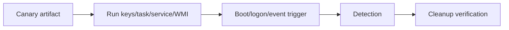
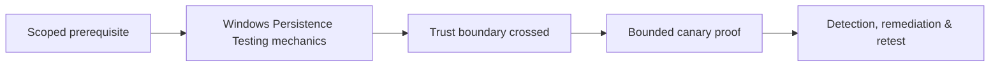

# Windows Persistence Testing

Authorized persistence testing validates whether defenders detect and remove durable execution or access mechanisms.



Categories include scheduled tasks, services, Run/RunOnce keys, startup folders, WMI event subscriptions, COM/extension points, Office/application add-ins, account/group changes, remote-management configuration, and boot/logon scripts. Use inert canary programs that write one marker and exit.

Track artifact path, owner, trigger, creation command, expected telemetry, rollback, and verification. Never hide artifacts from the blue team during a cooperative exercise.

Mastery lab: create and remove one canary task, service, registry trigger, and WMI subscription in a disposable host; correlate event and endpoint telemetry.

---
> 🔼 Up: [[Post-Exploitation & Persistence]]

## Core Concept

**Windows Persistence Testing** is the atomic learning objective of this note. Identify its trust boundary, prerequisites, attacker-controlled input or state, vulnerable transformation, violated security invariant, minimum evidence, business consequence, and safe stopping point. The mechanism must remain explainable without depending on a specific product.

## Visual Attack Flow



## Practical Payloads & Execution

```text
fixture=Windows Persistence Testing
build=instrumented-debug
action=trigger minimized canary input
impact_ceiling=fixed marker or deterministic crash
```

### Expected output

```text
result=C2R_CANARY_PROOF
mitigation_state=recorded
production_boundary_crossed=false
```

Treat the output as proof of only the stated condition. Repeat with a negative control, preserve timestamps and the affected build, and never expand impact merely because another path appears reachable.

## Real-World Scenario

A vendor-owned instrumented build reproduces **Windows Persistence Testing**. The researcher demonstrates only a fixed marker or deterministic crash, records architecture and mitigation assumptions, patches the root defect, and retains the minimized input as a regression test.

The durable remediation belongs at the authoritative enforcement layer. Retest the original condition and meaningful variants while verifying legitimate workflows still function.
