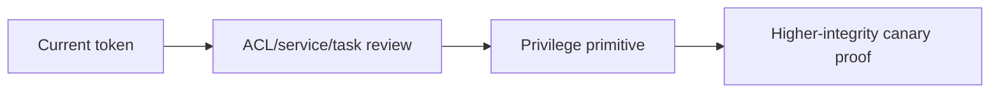
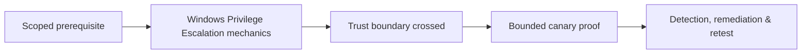

# Windows Privilege Escalation

Windows escalation depends on access tokens, privileges, services, registry/filesystem ACLs, scheduled tasks, installers, DLL search, impersonation, UAC boundaries, and vulnerable drivers/software.



Assess unquoted service paths, writable service binaries/configuration, weak task paths, DLL search order, autoruns, installer policy, token impersonation privileges, named pipes, registry hijacks, credential material, driver/kernel exposure, and patch level. Potato-family techniques rely on specific impersonation/coercion conditions and should be reproduced in disposable hosts.

```powershell
PS C:\> whoami /priv
PRIVILEGES INFORMATION
SeChangeNotifyPrivilege  Enabled
PS C:\> Get-CimInstance Win32_Service | Select Name,StartName,PathName
```

Use reversible test services/tasks and avoid disabling EDR. Mastery lab: validate four misconfiguration classes, collect Event Log/Sysmon evidence, remediate ACLs, and retest.

---
> 🔼 Up: [[Post-Exploitation & Persistence]]

## Core Concept

**Windows Privilege Escalation** is the atomic learning objective of this note. Identify its trust boundary, prerequisites, attacker-controlled input or state, vulnerable transformation, violated security invariant, minimum evidence, business consequence, and safe stopping point. The mechanism must remain explainable without depending on a specific product.

## Visual Attack Flow



## Practical Payloads & Execution

```text
fixture=Windows Privilege Escalation
build=instrumented-debug
action=trigger minimized canary input
impact_ceiling=fixed marker or deterministic crash
```

### Expected output

```text
result=C2R_CANARY_PROOF
mitigation_state=recorded
production_boundary_crossed=false
```

Treat the output as proof of only the stated condition. Repeat with a negative control, preserve timestamps and the affected build, and never expand impact merely because another path appears reachable.

## Real-World Scenario

A vendor-owned instrumented build reproduces **Windows Privilege Escalation**. The researcher demonstrates only a fixed marker or deterministic crash, records architecture and mitigation assumptions, patches the root defect, and retains the minimized input as a regression test.

The durable remediation belongs at the authoritative enforcement layer. Retest the original condition and meaningful variants while verifying legitimate workflows still function.
