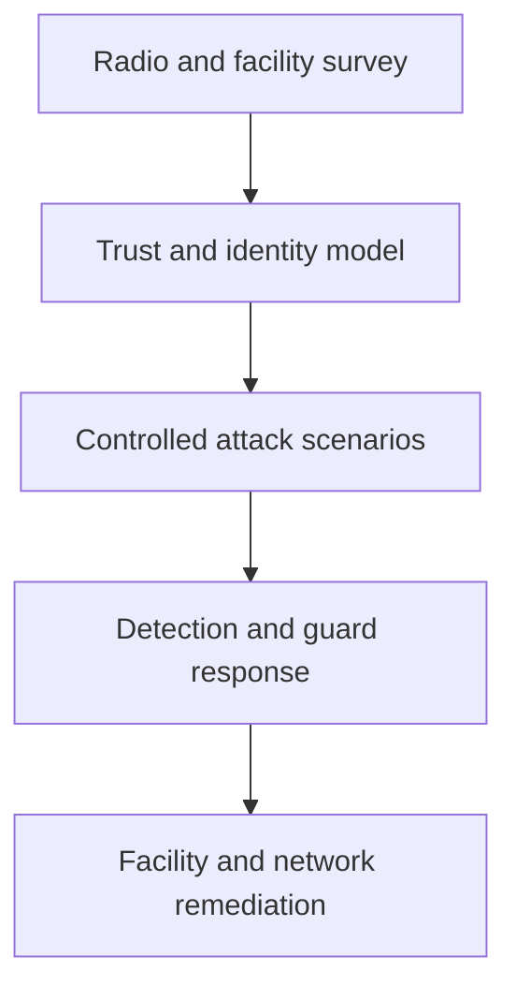

# Wireless & Physical Penetration Testing

> [!abstract] Lifecycle branch
> Authorized assessment of radio trust, enterprise WLAN identity, rogue infrastructure, badge technologies, physical controls, and the business processes that connect facilities to digital access.



## Master notes

- [[Wireless WPA2 & WPA3 Security Testing]]
- [[Rogue Access Points & Wireless Trust]]
- [[RFID & Physical Access Testing]]

## Safety envelope

```text
Approved SSIDs/BSSIDs: documented
Transmit-power ceiling: documented
Deauthentication testing: separately approved or prohibited
Badge population: synthetic test badges only
Facility escort and emergency stop contact: assigned
```

---
> 🔼 Up: [[Penetration Testing]]
