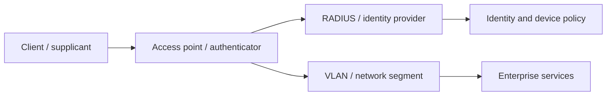
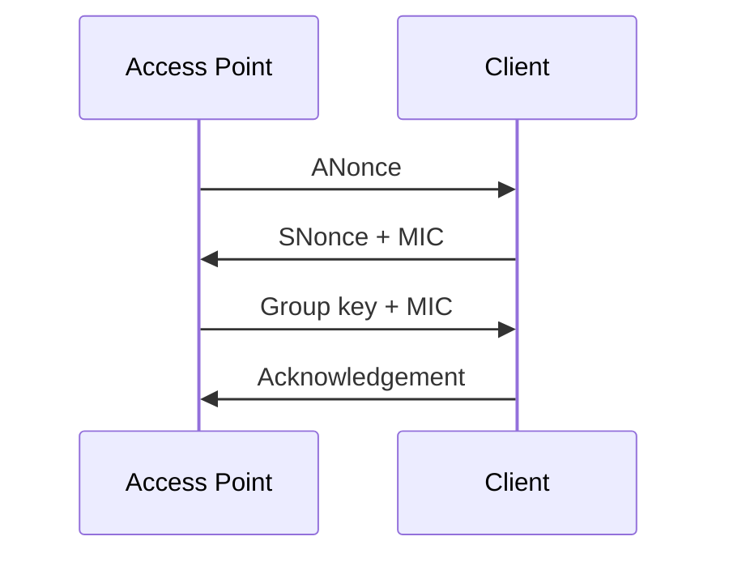

# Wireless WPA2 & WPA3 Security Testing

> [!abstract] Enterprise methodology
> Wireless testing evaluates radio exposure, WPA2/WPA3 cryptography, personal versus enterprise authentication, management-frame protection, client isolation, roaming, segmentation, and whether WLAN identity correctly maps into corporate authorization.

> [!danger] Radio safety
> Radio transmissions affect devices beyond walls and property lines. Use approved channels, SSIDs/BSSIDs, locations, transmit power, test clients, and time windows. Deauthentication, jamming, and credential capture require separate authorization.

## WLAN security architecture



## WPA2-Personal

WPA2-Personal derives a Pairwise Master Key from the passphrase and SSID. The four-way handshake proves possession and derives session keys without transmitting the passphrase.



Testing focuses on passphrase policy, reuse across locations, guest/corporate separation, rotation, WPS exposure, and whether captured authentication material enables an authorized offline strength audit.

Representative survey output:

```text
SSID             Security        PMF       Channel
Corp-Legacy      WPA2-PSK        capable   36
Corp-Enterprise  WPA2-EAP        required  44
Guest            WPA2-PSK        disabled  6
```

The output becomes risk only after mapping each SSID to business purpose and reachable network.

## WPA3-Personal and SAE

WPA3 replaces PSK authentication with Simultaneous Authentication of Equals, providing resistance to straightforward passive offline guessing and forward secrecy. Assess:

- SAE-only versus transition mode.
- Client downgrade to WPA2.
- Password quality and group selection.
- Protected Management Frames (PMF) enforcement.
- Legacy client islands and alternate SSIDs.
- Rate limiting against active guessing.

Transition mode expands compatibility but may preserve the weakest WPA2 path. Test with client-owned devices and document which mode each actually negotiates.

## WPA2/3-Enterprise and EAP

Enterprise WLAN security depends on EAP method, certificate validation, identity policy, and RADIUS configuration:

| EAP design | Security question |
|---|---|
| EAP-TLS | Are client/server certificates validated and lifecycle-managed? |
| PEAP/MSCHAPv2 | Do clients validate server identity before sending credentials? |
| EAP-TTLS | Are inner methods and certificate trust configured safely? |
| Device/user certificates | Are identities mapped to correct VLANs and roles? |

Use a test identity to verify certificate trust, revocation, expired certificates, device posture, identity privacy, and role assignment. A secure EAP method can still fail if users can accept an untrusted server certificate.

## Management frames and availability

PMF protects selected deauthentication/disassociation and management frames. Verify whether it is disabled, capable, or required, and whether all supported clients can comply. Availability tests should be bounded; do not disrupt production associations merely to demonstrate that radio is a shared medium.

## Segmentation and client isolation

From each authorized SSID, measure:

- Addressing, DNS, gateway, and captive-portal behavior.
- Reachability to peer clients.
- Reachability to corporate, management, voice, IoT, and guest zones.
- Identity-to-VLAN consistency.
- IPv4/IPv6 policy parity.
- Reauthentication and roaming behavior.

```text
Test client: wireless-audit-01
SSID: Guest
Expected: internet only; no peer/corporate access
Observed: TCP reachability to printer VLAN on 9100/tcp
Impact: guest-to-internal segmentation violation
```

## Enterprise remediation

Prefer WPA3-Enterprise or WPA2-Enterprise with strong EAP-TLS, enforce certificate validation and PMF, remove WPS, isolate guest/IoT, rotate shared secrets, monitor rogue BSSIDs, and validate policy across all controllers and sites.

---
> 🔼 Up: [[Wireless & Physical Penetration Testing]]
