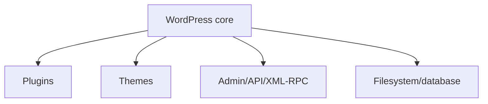
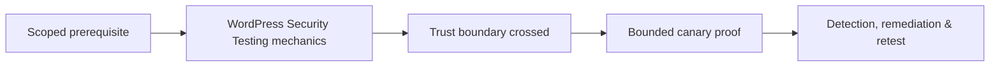

# WordPress Security Testing

Model core, plugins, themes, uploads, REST API, XML-RPC, cron, database, filesystem, web server, and administrative roles.



Inventory exact versions and provenance, exposed users, debug/backup files, upload execution, REST permissions, XML-RPC necessity, role capabilities, secrets, file editor, update policy, and plugin/theme abandonment. Validate known vulnerabilities against vendor advisories and canary fixtures.

Do not brute-force accounts or exploit production plugins merely from version detection. Remediate through minimal maintained extensions, rapid updates, strong admin authentication, least privilege, non-executable uploads, protected config/backups, monitoring, and tested recovery.

Mastery lab: harden a deliberately weak site and produce component inventory, attack paths, safe proofs, and update/removal plan.

---
> 🔼 Up: [[CMS & Framework Security Testing]]

## Core Concept

**WordPress Security Testing** is the atomic learning objective of this note. Identify its trust boundary, prerequisites, attacker-controlled input or state, vulnerable transformation, violated security invariant, minimum evidence, business consequence, and safe stopping point. The mechanism must remain explainable without depending on a specific product.

## Visual Attack Flow



## Practical Payloads & Execution

```http
POST /c2r-lab/wordpress-security-testing HTTP/1.1
Host: app.example.test
Authorization: Bearer <CANARY_IDENTITY>
Content-Type: application/json

{"object":"C2R-CANARY","test":true}
```

### Expected output

```text
HTTP/1.1 200 OK
X-C2R-Result: vulnerable-condition-observed
{"marker":"C2R-CANARY-PROOF"}
```

Treat the output as proof of only the stated condition. Repeat with a negative control, preserve timestamps and the affected build, and never expand impact merely because another path appears reachable.

## Real-World Scenario

A multi-tenant enterprise service exposes a scoped **WordPress Security Testing** condition to a synthetic customer account. The assessor proves one trust-boundary failure with a canary object, correlates application and identity telemetry, removes test state, and assigns the authoritative server-side control.

The durable remediation belongs at the authoritative enforcement layer. Retest the original condition and meaningful variants while verifying legitimate workflows still function.
