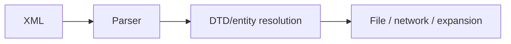
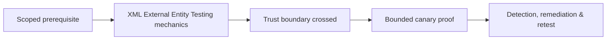

# XML External Entity Testing

XXE arises when XML parsers resolve attacker-controlled external entities or related references.



Assess classic reflected entities, blind/out-of-band resolution, parameter entities, XInclude, schema imports, XSLT, and parser/entity expansion limits. Use a client-owned canary endpoint and harmless fixture file; never retrieve sensitive local files.

```xml
<?xml version="1.0"?>
<!DOCTYPE c2r [<!ENTITY marker SYSTEM "https://oob.example.test/c2r-42">]>
<request>&marker;</request>
```

Remediate by disabling DTD/external resolution, using hardened parser factories, allowlisting schemas, denying parser network access, limiting expansion/depth/size, and avoiding XML when unnecessary. Mastery lab: compare parser defaults across languages and verify network isolation prevents blind resolution.

---
> 🔼 Up: [[File, Parser & Serialization Security]]

## Core Concept

**XML External Entity Testing** is the atomic learning objective of this note. Identify its trust boundary, prerequisites, attacker-controlled input or state, vulnerable transformation, violated security invariant, minimum evidence, business consequence, and safe stopping point. The mechanism must remain explainable without depending on a specific product.

## Visual Attack Flow



## Practical Payloads & Execution

```http
POST /c2r-lab/xml-external-entity-testing HTTP/1.1
Host: app.example.test
Authorization: Bearer <CANARY_IDENTITY>
Content-Type: application/json

{"object":"C2R-CANARY","test":true}
```

### Expected output

```text
HTTP/1.1 200 OK
X-C2R-Result: vulnerable-condition-observed
{"marker":"C2R-CANARY-PROOF"}
```

Treat the output as proof of only the stated condition. Repeat with a negative control, preserve timestamps and the affected build, and never expand impact merely because another path appears reachable.

## Real-World Scenario

A multi-tenant enterprise service exposes a scoped **XML External Entity Testing** condition to a synthetic customer account. The assessor proves one trust-boundary failure with a canary object, correlates application and identity telemetry, removes test state, and assigns the authoritative server-side control.

The durable remediation belongs at the authoritative enforcement layer. Retest the original condition and meaningful variants while verifying legitimate workflows still function.
