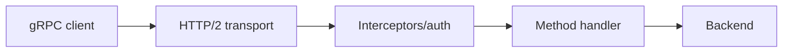
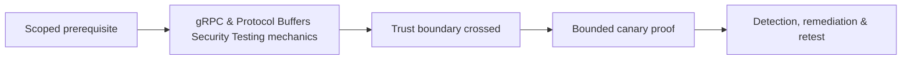

# gRPC & Protocol Buffers Security Testing

gRPC uses HTTP/2, protobuf schemas, unary/streaming RPCs, metadata, deadlines, and interceptors.



Inventory services/methods through approved reflection or supplied descriptors. Test authentication metadata, method authorization, message field validation, unknown/default fields, oneof semantics, streaming lifecycle, cancellation, deadlines, size limits, resource exhaustion, TLS/mTLS identity, gateway transcoding, and error details.

```text
service: Billing.GetInvoice
identity: tenant-B canary
request: invoice A-42
expected: PermissionDenied
observed: OK with canary record
```

Remediate with interceptor plus handler authorization, strict validation, bounded streams/messages, deadlines, mTLS where appropriate, safe reflection, and consistent gateway policy. Mastery lab: test unary, server-streaming, and client-streaming canary methods.

---
> 🔼 Up: [[API & Modern Protocol Testing]]

## Core Concept

**gRPC & Protocol Buffers Security Testing** is the atomic learning objective of this note. Identify its trust boundary, prerequisites, attacker-controlled input or state, vulnerable transformation, violated security invariant, minimum evidence, business consequence, and safe stopping point. The mechanism must remain explainable without depending on a specific product.

## Visual Attack Flow



## Practical Payloads & Execution

```http
POST /c2r-lab/grpc-protocol-buffers-security-testing HTTP/1.1
Host: app.example.test
Authorization: Bearer <CANARY_IDENTITY>
Content-Type: application/json

{"object":"C2R-CANARY","test":true}
```

### Expected output

```text
HTTP/1.1 200 OK
X-C2R-Result: vulnerable-condition-observed
{"marker":"C2R-CANARY-PROOF"}
```

Treat the output as proof of only the stated condition. Repeat with a negative control, preserve timestamps and the affected build, and never expand impact merely because another path appears reachable.

## Real-World Scenario

A multi-tenant enterprise service exposes a scoped **gRPC & Protocol Buffers Security Testing** condition to a synthetic customer account. The assessor proves one trust-boundary failure with a canary object, correlates application and identity telemetry, removes test state, and assigns the authoritative server-side control.

The durable remediation belongs at the authoritative enforcement layer. Retest the original condition and meaningful variants while verifying legitimate workflows still function.
