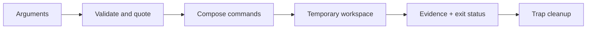

# Bash for Security Operations

Bash is the orchestration language of Unix operations. It is strongest when composing trusted programs and weakest when parsing complex untrusted data. Quote expansions, make failures explicit, and graduate to Python or Go when state or input grammar becomes complex.



## Safe script skeleton

```bash
#!/usr/bin/env bash
set -Eeuo pipefail
IFS=$'\n\t'

usage() { printf 'usage: %s INPUT OUTPUT\n' "${0##*/}" >&2; exit 2; }
[[ $# -eq 2 ]] || usage
input=$1; output=$2
[[ -r "$input" ]] || { printf 'not readable: %s\n' "$input" >&2; exit 3; }

workdir=$(mktemp -d)
cleanup() { rm -rf -- "$workdir"; }
trap cleanup EXIT INT TERM

awk 'NF && $1 !~ /^#/' "$input" | sort -u > "$workdir/normalized.txt"
install -m 0600 "$workdir/normalized.txt" "$output"
sha256sum -- "$output"
```

```shell-session
analyst@lab:~$ ./normalize.sh scope.txt scope.normalized
f54c01...  scope.normalized
analyst@lab:~$ stat -c '%a %n' scope.normalized
600 scope.normalized
```

`set -e` alone is not enough; `-u` rejects unset variables, `pipefail` propagates pipeline failures, and `-E` preserves error traps in functions. Quote `"$var"`, use arrays for command arguments, place `--` before path operands, and never evaluate untrusted text.

## Arrays and parallel control

```bash
targets=("192.0.2.10" "192.0.2.20")
ports=(22 443)
for target in "${targets[@]}"; do
  for port in "${ports[@]}"; do
    timeout 2 bash -c 'exec 3<>/dev/tcp/$1/$2' _ "$target" "$port" \
      && printf '%s,%s,open\n' "$target" "$port" \
      || printf '%s,%s,closed-or-filtered\n' "$target" "$port"
  done
done
```

For concurrency, prefer `xargs -P` with a small fixed count and exported functions, or GNU Parallel with an explicit jobs limit. Capture stderr separately and preserve exit codes.

## Defensive evidence triage

```shell-session
analyst@sensor:~$ journalctl --since '2026-07-30 08:00:00' --until '2026-07-30 09:00:00' -o json \
  | jq -r 'select(._SYSTEMD_UNIT=="sshd.service") | [."__REALTIME_TIMESTAMP", .MESSAGE] | @tsv' \
  | head
1753862601000000 Accepted publickey for analyst from 192.0.2.44 port 51218 ssh2
```

Avoid `for x in $(command)` because word splitting corrupts spaces and glob characters. Prefer `while IFS= read -r line`. Use `shellcheck` and `shfmt` in CI.

```shell-session
engineer@lab:~$ shellcheck normalize.sh
engineer@lab:~$ bash -n normalize.sh
```

No output means both checks passed.

## Expansion order & injection hazards

Bash performs parameter, command, arithmetic, and pathname expansion plus word splitting. Quoting controls several phases. Data must never become shell syntax through `eval`, `bash -c "$untrusted"`, or concatenated commands. Use arrays:

```bash
cmd=(curl --fail --silent --show-error --max-time 5)
cmd+=(--header 'X-C2R-Test: authorized')
cmd+=(-- "$url")
"${cmd[@]}"
```

Each array element remains one argument even with spaces or glob characters.

## File-safe loops & null delimiters

```bash
find evidence -type f -print0 |
  while IFS= read -r -d '' path; do
    sha256sum -- "$path"
  done
```

Newline-delimited filenames are ambiguous. Use NUL-capable tools for arbitrary paths. Avoid parsing `ls`; use globs or `find`.

## Error handling & observability

`set -e` has exceptions in conditionals, pipelines, subshells, and command substitutions. Check expected failures explicitly. An `ERR` trap can log line/command/status, but redact arguments. Separate human diagnostics on stderr from machine results on stdout. Preserve child exit codes.

## Crook2Root master project

Build an evidence-bundling script that validates an engagement directory, rejects symlinks/out-of-root paths, creates a temporary manifest, hashes files with NUL-safe traversal, redacts named metadata, builds an archive atomically, verifies it, records tool versions, and cleans up on signals. Test spaces, newlines, leading dashes, permission failures, disk full, interrupt, and concurrent modification.

```shell-session
engineer@lab:~$ bats test/evidence_bundle.bats
 ✓ rejects output outside approved root
 ✓ handles newline in filename
 ✓ removes temporary files on SIGTERM
 ✓ produces reproducible manifest
4 tests, 0 failures
```

## When to stop using Bash

Move to Python, Go, or C++ when parsing nested data, maintaining complex state, handling untrusted binary formats, requiring portable concurrency, or needing robust unit-testable abstractions. Bash should orchestrate strong tools, not reimplement them poorly.

---
> 🔼 Up: [[Programming for Security]]
