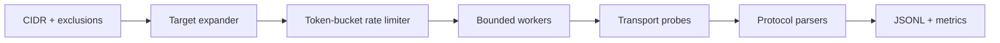

# Building Network Scanners

This engineering guide covers safe scanners for owned labs and authorized ranges: target expansion, transport state, concurrency, rate control, protocol probes, normalization, and resumable evidence.



## Correct state model

For TCP connect probes, success means **open**, connection refusal means **closed**, and timeout commonly means **filtered or unreachable**. Do not collapse these into a Boolean. UDP is inference-driven: an application response proves open, ICMP port unreachable supports closed, and silence is open-or-filtered.

```text
tcp/open             completed handshake
tcp/closed           immediate RST or ECONNREFUSED
tcp/filtered         timeout or policy-denied indication
udp/open             valid application response
udp/closed           ICMP destination/port unreachable
udp/open-or-filtered no useful response
```

## Rate and resource controls

Bound in-flight sockets, attempts per second, retries, response bytes, and total run duration independently. Random jitter can avoid synchronized bursts but must not be marketed as stealth. Respect exclusions after DNS resolution as well as before it.

```shell-session
developer@lab:~$ scanner --scope 192.0.2.0/29 --exclude 192.0.2.3 --ports 22,80,443 --rate 20 --workers 8 --dry-run
targets=5 ports=3 planned=15 excluded=1 network=192.0.2.0 broadcast=192.0.2.7
developer@lab:~$ scanner --config approved.yaml --output run.jsonl
complete attempted=15 open=3 closed=8 filtered=4 errors=0
```

## Probe architecture

A transport probe should return typed observations, not prose. Protocol modules can then perform a bounded TLS ClientHello, HTTP `HEAD`, SSH banner read, or DNS query. Never trust a banner as definitive product identity; retain raw bytes and parser confidence.

```json
{"target":"192.0.2.2","port":443,"transport":"tcp","state":"open","rtt_ms":4,"probe":"tls-clienthello","observation":{"tls":"1.3","alpn":"h2"}}
```

## Testing

Use deterministic fake clocks for rate-limit tests, loopback fixtures for state mapping, packet captures for protocol correctness, and fuzzing for every banner parser. Verify cancellation closes sockets and leaves valid JSONL. Integration tests must use reserved or isolated addresses, never public networks by default.

---
> 🔼 Up: [[Writing Your Own Tools]]
