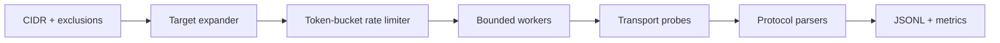
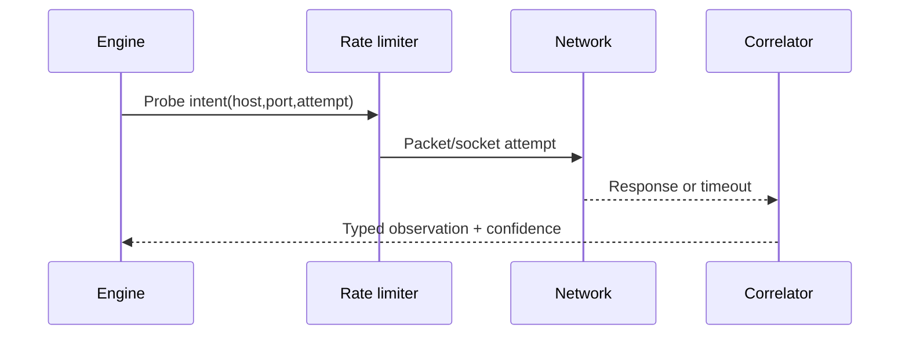

# Building Network Scanners

This engineering guide covers safe scanners for owned labs and authorized ranges: target expansion, transport state, concurrency, rate control, protocol probes, normalization, and resumable evidence.



## Correct state model

For TCP connect probes, success means **open**, connection refusal means **closed**, and timeout commonly means **filtered or unreachable**. Do not collapse these into a Boolean. UDP is inference-driven: an application response proves open, ICMP port unreachable supports closed, and silence is open-or-filtered.

```text
tcp/open             completed handshake
tcp/closed           immediate RST or ECONNREFUSED
tcp/filtered         timeout or policy-denied indication
udp/open             valid application response
udp/closed           ICMP destination/port unreachable
udp/open-or-filtered no useful response
```

## Rate and resource controls

Bound in-flight sockets, attempts per second, retries, response bytes, and total run duration independently. Random jitter can avoid synchronized bursts but must not be marketed as stealth. Respect exclusions after DNS resolution as well as before it.

```shell-session
developer@lab:~$ scanner --scope 192.0.2.0/29 --exclude 192.0.2.3 --ports 22,80,443 --rate 20 --workers 8 --dry-run
targets=5 ports=3 planned=15 excluded=1 network=192.0.2.0 broadcast=192.0.2.7
developer@lab:~$ scanner --config approved.yaml --output run.jsonl
complete attempted=15 open=3 closed=8 filtered=4 errors=0
```

## Probe architecture

A transport probe should return typed observations, not prose. Protocol modules can then perform a bounded TLS ClientHello, HTTP `HEAD`, SSH banner read, or DNS query. Never trust a banner as definitive product identity; retain raw bytes and parser confidence.

```json
{"target":"192.0.2.2","port":443,"transport":"tcp","state":"open","rtt_ms":4,"probe":"tls-clienthello","observation":{"tls":"1.3","alpn":"h2"}}
```

## Testing

Use deterministic fake clocks for rate-limit tests, loopback fixtures for state mapping, packet captures for protocol correctness, and fuzzing for every banner parser. Verify cancellation closes sockets and leaves valid JSONL. Integration tests must use reserved or isolated addresses, never public networks by default.

## Target expansion & scope safety

Parse IP/CIDR with standard libraries, reject hostnames where the contract requires addresses, remove network/broadcast only when semantically appropriate, deduplicate, apply exclusions after every resolution, and cap expanded target count. DNS can change between plan and execution; bind approved resolutions into the signed plan or revalidate against policy.

## Raw SYN vs connect architecture

A connect scanner delegates handshake/state to the OS and works unprivileged but consumes local sockets/ephemeral ports. A raw SYN scanner constructs packets and correlates replies, requiring privileges and handling checksums, sequence correlation, retransmission, routing, and interface selection. UDP needs protocol-specific payloads and ICMP correlation.



## Protocol plugins

Define maximum request bytes, response bytes, round trips, timeout, accepted states, and parser version. TLS needs SNI/ALPN and certificate validation policy; HTTP needs Host and redirect boundaries; SSH banner reads need byte/line limits; DNS needs transaction-ID correlation.

## Measurement & benchmarking

Measure accuracy before speed. Fixtures must include open, closed, silently filtered, actively rejected, delayed, rate-limited, tarpitted, dual-stack, NATed, and banner-malformed services. Record CPU, memory, descriptors, packets, attempts/sec, p50/p95 latency, loss, and false states.

## Master project

Implement connect TCP plus two safe protocol plugins. Add token-bucket rate, per-host concurrency, cancellation, checkpoint/resume, deterministic JSONL, raw-evidence option, and a dry-run plan. Compare with packet capture and two reference tools. Fuzz every parser and demonstrate no descriptor leaks under forced timeout.

---
> 🔼 Up: [[Writing Your Own Tools]]
