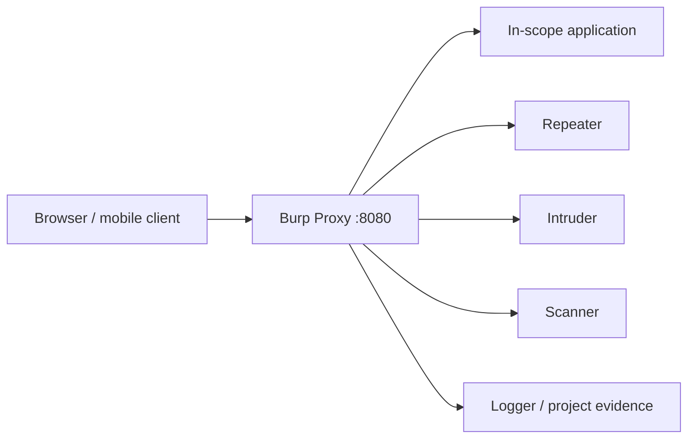

# Burp Suite

Burp Suite is an intercepting-proxy platform for mapping applications, replaying HTTP/WebSocket traffic, testing input boundaries, and organizing evidence. Community Edition provides the core manual workflow; Professional adds automation and advanced tooling.

> [!warning] Authorized application testing
> Configure target scope before browsing. Never let Scanner, Intruder, extensions, or macros reach third-party domains or production actions excluded by the Rules of Engagement.



## Installation & trust setup

Install from the vendor, verify the release, use a supported JVM/package, and keep project files encrypted. Bind the proxy to loopback unless a specific test device needs remote access. Import the Burp CA only into a dedicated test profile; remove it after the engagement.

```text
Proxy listener: 127.0.0.1:8080
Browser proxy:   HTTP/HTTPS -> 127.0.0.1:8080
Target scope:    https://app.example.test/*
Out-of-scope:    analytics.example.net, payment-provider.example
```

## Core tools

| Tool | Primary use |
|---|---|
| Proxy / HTTP history | Capture, intercept, annotate, compare |
| Target / Site map | Organize endpoints, parameters, content |
| Repeater | Hand-edit & replay one request |
| Intruder | Bounded payload placement & response clustering |
| Sequencer | Analyze token randomness from approved samples |
| Decoder | Transform URL, Base64, hex, HTML, hashes |
| Comparer | Byte/word difference between responses |
| Collaborator | Detect authorized out-of-band interactions |
| Scanner | Automated passive/active checks in Professional |
| Logger | Central extension/tool traffic inspection |

## Repeater workflow

```http
GET /api/v1/profile HTTP/1.1
Host: app.example.test
Cookie: session=REDACTED
X-C2R-Test: authorized

HTTP/1.1 200 OK
Content-Type: application/json
X-Request-ID: 4fbb12

{"id":"test-user-01","role":"user"}
```

Send from Proxy history to Repeater, rename the tab by hypothesis, duplicate a control request, alter one element, and compare status, length, headers, body, timing, and side effects. Preserve request IDs and redact tokens before export.

## Intruder controls

Attack types include Sniper (one position at a time), Battering Ram (same payload in all positions), Pitchfork (parallel payload sets), and Cluster Bomb (Cartesian product). Configure payload encoding, grep-match/extract, response length, concurrency, retries, and rate. Calculate request count before launch.

```text
2 positions x 500 payloads in Cluster Bomb = 250,000 requests
At 5 req/s = nearly 14 hours before retries
```

## Scope, sessions & extensions

Use suite scope and “show only in-scope items.” Session handling rules can refresh test sessions through macros; verify they cannot submit destructive workflows. BApp extensions run with access to captured secrets and traffic, so review source, permissions, update provenance, and project suitability. Avoid sending sensitive traffic to cloud-backed extensions.

## Evidence

Save the project, selected raw requests/responses, issue activity, extension list, Burp version, scope configuration, and test account role map. A generated Scanner issue is a hypothesis until manually reproduced and tied to business impact.

## Project architecture & data handling

Use temporary projects for disposable labs and disk projects for long engagements. Project files may contain authentication tokens, personal data, uploaded documents, and complete API responses. Store them on encrypted media, exclude them from repository sync, configure backup/retention, and sanitize exports.

Separate **project settings** (engagement-specific scope, sessions, upstream proxy) from **user settings** (operator UI and reusable defaults). Export reviewed configuration profiles rather than rebuilding critical scope controls manually.

## Advanced manual workflow

```text
Proxy history -> add to scope -> map role/action -> send control to Repeater
-> duplicate tab -> change one variable -> compare -> record request ID
-> test adjacent method/content type/state -> create finding evidence
```

Use Repeater groups for related requests, Inspector for decoded parameters, and Comparer for subtle authorization or cache differences. For WebSockets, inspect handshake and message direction, then change one frame while preserving application state.

## Collaborator & out-of-band testing

Collaborator-style interactions can establish server-side DNS/HTTP/SMTP behavior when responses are blind. Use client-approved infrastructure, unique identifiers, finite polling, and evidence timestamps. Never send production secrets to an external service.

## Crook2Root lab

Create a three-role application fixture. Map it entirely, then test one object operation through Proxy/Repeater, one workflow with a session macro, one bounded Intruder job, and one out-of-band canary. Export a sanitized evidence pack and reconstruct the finding from it on another workstation.

## Troubleshooting

- HTTPS fails: inspect proxy selection, CA trust, certificate pinning, SNI, HTTP/2, and upstream proxy.
- Browser traffic bypasses Burp: check OS/browser proxy, QUIC/HTTP3, proxy exceptions, and service workers.
- Macro loops/fails: validate cookie extraction, anti-CSRF handling, redirect sequence, and success marker.
- Scanner noise: tighten scope, insertion-point types, crawl depth, concurrency, and excluded paths.
- Extension instability: disable extensions, inspect Logger, review compatibility, and reproduce in a clean profile.

---
> 🔼 Up: [[Web Application Testing Tools]]
