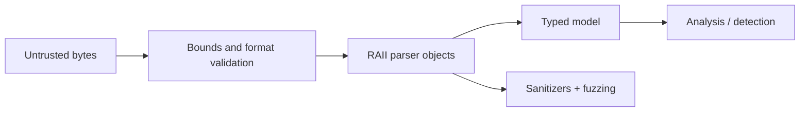

# C++ for Security Engineering

C++ matters in security because kernels, browsers, endpoint agents, parsers, emulators, and native libraries expose machine-level memory, ABI, concurrency, and performance behavior. Mastery means using that control without recreating the memory-safety failures being investigated.



## Reproducible toolchain

```shell-session
engineer@lab:~/native-tool$ cmake -S . -B build -DCMAKE_BUILD_TYPE=RelWithDebInfo
-- Configuring done
-- Generating done
engineer@lab:~/native-tool$ cmake --build build --parallel
[100%] Built target packet_parser
engineer@lab:~/native-tool$ ctest --test-dir build --output-on-failure
100% tests passed, 0 tests failed out of 14
```

Compile development builds with aggressive diagnostics:

```cmake
target_compile_features(packet_parser PRIVATE cxx_std_20)
target_compile_options(packet_parser PRIVATE
  -Wall -Wextra -Wpedantic -Wconversion -Wshadow
  -fno-omit-frame-pointer -fsanitize=address,undefined)
target_link_options(packet_parser PRIVATE -fsanitize=address,undefined)
```

For Clang use comparable flags. Add stack protection, PIE, RELRO, control-flow protection, and fortified libc calls according to platform and compiler support; verify emitted properties rather than assuming a flag took effect.

## Safe binary parsing

```cpp
#include <cstddef>
#include <cstdint>
#include <optional>
#include <span>

struct Header { std::uint8_t version; std::uint16_t length; };

std::optional<Header> parse_header(std::span<const std::byte> bytes) {
    if (bytes.size() < 3) return std::nullopt;
    auto u = [](std::byte b) { return std::to_integer<std::uint8_t>(b); };
    const auto length = static_cast<std::uint16_t>((u(bytes[1]) << 8) | u(bytes[2]));
    if (length < 3 || length > bytes.size()) return std::nullopt;
    return Header{u(bytes[0]), length};
}
```

`std::span` carries a size without owning memory, fixed-width integers make layout intent explicit, and `std::optional` forces the caller to handle malformed input. Never cast an untrusted byte buffer directly to a structure: alignment, padding, endianness, and length can all invalidate the assumption.

```shell-session
engineer@lab:~$ ./packet_parser fixtures/valid.bin
version=2 declared_length=48 status=valid
engineer@lab:~$ ./packet_parser fixtures/truncated.bin
error=invalid_header reason=declared_length_exceeds_input
```

## Ownership, lifetimes, and concurrency

- Prefer values, `std::unique_ptr`, and RAII; make ownership visible.
- Use `std::vector`, `std::array`, `std::string`, and spans instead of raw allocation.
- Avoid returning views into temporary or reallocated storage.
- Use `std::jthread` and stop tokens for cancellable workers.
- Protect invariants with scoped locks; define lock order to prevent deadlock.
- Use atomics only with a documented memory-ordering model.
- Keep privilege and parser boundaries in separate processes when compromise impact is high.

## Sanitizers, fuzzing, and hardening

```shell-session
engineer@lab:~$ clang++ -std=c++20 -g -O1 -fsanitize=fuzzer,address,undefined fuzz_header.cpp parser.cpp -o fuzz_header
engineer@lab:~$ ./fuzz_header corpus/ -max_total_time=30
#1048576 DONE cov: 87 ft: 143 corp: 29/812b lim: 4096 exec/s: 34952
Done 1048576 runs in 30 second(s)
```

Use AddressSanitizer for out-of-bounds/use-after-free, UndefinedBehaviorSanitizer for invalid operations, ThreadSanitizer for data races, and libFuzzer/AFL++ for parser exploration. Run static analysis (`clang-tidy`, compiler analyzer), dependency/SBOM checks, reproducible release builds, and signature verification. Sanitizers are testing instruments, not production hardening by themselves.

## Interoperability and use cases

C++ tools often consume libpcap, operating-system APIs, LLVM, disassembly libraries, or C ABIs. Wrap foreign handles in RAII types, translate error codes at the boundary, and never let C++ exceptions cross a C ABI. Suitable projects include packet decoders, file-format validators, endpoint collectors, emulators, sandboxed analysis components, and fuzzing harnesses.

## ABI, object layout & undefined behavior

Security work requires understanding calling conventions, stack frames, vtables, padding/alignment, name mangling, dynamic linking, exceptions, RTTI, and platform ABIs. The language permits undefined behavior for out-of-bounds access, lifetime violations, signed overflow, invalid shifts, and data races; optimization can transform UB in surprising ways.

Use `static_assert`, `std::bit_cast`, explicit serialization, checked arithmetic, and narrow conversions. Never use packed structs as a universal wire parser.

## Modern secure patterns

Prefer `std::span`, `std::string_view` with documented lifetime, `std::expected` where available, smart pointers, range algorithms, scoped enums, chrono types, and RAII wrappers. Avoid naked `new/delete`, owning raw pointers, C string functions, and unchecked iterator arithmetic. Validate before allocation to prevent integer-overflow and memory-exhaustion bugs.

## Native debugging toolkit

```shell-session
engineer@lab:~$ gdb --args ./packet_parser fixtures/truncated.bin
(gdb) break parse_header
(gdb) run
(gdb) bt
#0 parse_header (...) at parser.cpp:42
engineer@lab:~$ valgrind --leak-check=full ./packet_parser fixtures/valid.bin
ERROR SUMMARY: 0 errors from 0 contexts
```

Use GDB/LLDB, symbolized core dumps, `readelf`/`objdump`, sanitizers, Valgrind where suitable, and compiler optimization-aware debugging. Preserve build IDs and symbols separately for production diagnostics.

## Crook2Root master project

Build a sandboxed parser for a documented binary format. Include zero-copy bounded views, endian conversion, checked lengths, typed errors, corpus tests, libFuzzer/AFL++ harness, ASan/UBSan/TSan jobs, static analysis, coverage, performance benchmarks, hardening verification, SBOM, and signed packages. Run malformed inputs in a low-privilege process with resource limits.

## Failure analysis

Use-after-free often originates from view/iterator lifetime; double free from confused ownership; heap overflow from length arithmetic; race from unsynchronized shared state; parser denial-of-service from deeply nested or huge declared sizes. Reduce crashes to minimal inputs and add permanent regression tests.

---
> 🔼 Up: [[Programming for Security]]
