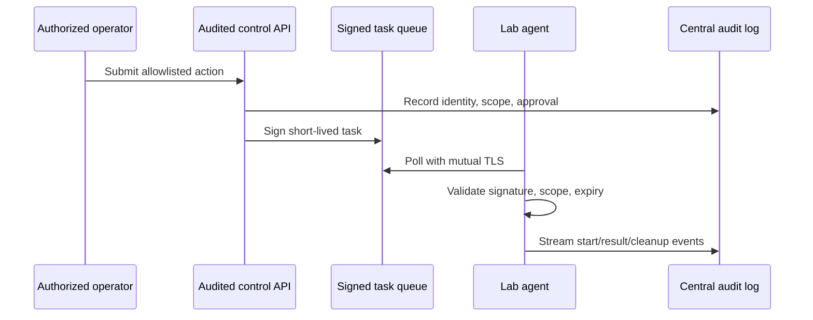

# Command & Control Design Principles

> [!warning] Controlled emulation only
> This chapter concerns transparent, auditable command-and-control emulators for owned cyber ranges and purple-team exercises. It deliberately excludes covert deployment, security-control bypass, persistence, and unauthorized access.

A safe C2 emulator coordinates pre-approved test actions while preserving operator identity, target consent, command provenance, cryptographic integrity, and immediate revocation.



## Control-plane requirements

- Mutual TLS with short-lived workload identities; no shared fleet secret.
- Role-based authorization and a second approval for high-impact lab actions.
- Allowlisted task schemas rather than arbitrary shell strings.
- Signed tasks containing agent ID, scope, nonce, issue/expiry time, and maximum runtime.
- Per-agent and global kill switches tested before exercises.
- Immutable, centralized audit events that endpoints cannot erase.
- A cleanup action and success predicate for every state-changing emulation.

```json
{
  "task_id": "sim-1042",
  "agent_id": "range-win-07",
  "action": "create_detection_marker",
  "args": {"marker": "C2R-PURPLE-1042"},
  "expires": "2026-07-30T10:05:00Z",
  "max_runtime_seconds": 20
}
```

```shell-session
operator@range:~$ c2lab submit task.json --approval CHG-20481
accepted task=sim-1042 agent=range-win-07 expires_in=287s
operator@range:~$ c2lab events sim-1042
10:00:13Z validated  signature=ok scope=ok
10:00:14Z completed  marker=C2R-PURPLE-1042
10:00:15Z cleaned    verification=absent
```

## Failure design

Agents must fail closed on stale tasks, clock skew beyond tolerance, unknown action types, scope mismatch, invalid signatures, and unavailable audit sinks. Queues need idempotency keys so retries do not duplicate side effects. Treat telemetry loss as an exercise stop condition.

## Purple-team value

The emulator should produce a published behavior catalog mapped to expected data sources and detections. Replaying a stable, transparent action makes defensive regression testing possible without hiding from the defenders being trained.

---
> 🔼 Up: [[Writing Your Own Tools]]
