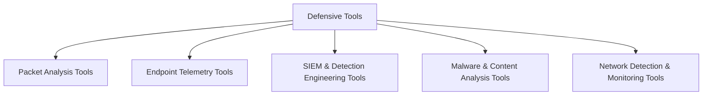

# Defensive Tools

> [!abstract] Purpose-driven defensive Armory
> Tools are grouped by the evidence or control they provide: packets, endpoint events, analytics, content classification, and network detection.



## Purpose categories

- [[Packet Analysis Tools]]
- [[Endpoint Telemetry Tools]]
- [[SIEM & Detection Engineering Tools]]
- [[Malware & Content Analysis Tools]]
- [[Network Detection & Monitoring Tools]]

```text
Collect trustworthy evidence -> normalize -> detect -> investigate -> contain -> improve
```

---
> 🔼 Up: [[Tooling]]
