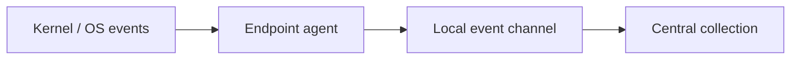

# Endpoint Telemetry Tools

Host instrumentation for process, network, image-load, registry, file, and identity events.



- [[Sysmon]]

```powershell
PS C:\> Get-WinEvent -LogName 'Microsoft-Windows-Sysmon/Operational' -MaxEvents 1 | Select-Object Id,TimeCreated
Id TimeCreated
-- -----------
 1 7/30/2026 10:20:14 AM
```

---
> 🔼 Up: [[Defensive Tools]]
