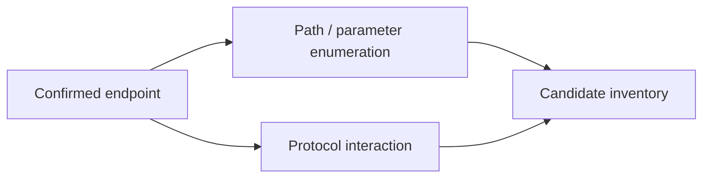

# Enumeration & Service Interaction Tools

Tools for discovering content, varying HTTP inputs, and interacting with TCP/UDP services after scope is established.



- [[Gobuster]]
- [[ffuf]]
- [[Netcat]]

```shell-session
operator@lab:~$ printf '%s\n' health api admin > approved-paths.txt
operator@lab:~$ wc -w approved-paths.txt
3 approved-paths.txt
```

---
> 🔼 Up: [[Offensive Tools]]
