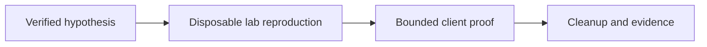

# Exploitation & Credential Testing Tools

Frameworks for bounded proof-of-exploit validation and explicitly authorized credential-control testing.



- [[Metasploit Framework]]
- [[Hydra]]

```shell-session
operator@lab:~$ printf '%s\n' 'max_attempts_per_account=2' 'lockout_threshold=5'
max_attempts_per_account=2
lockout_threshold=5
```

---
> 🔼 Up: [[Offensive Tools]]
