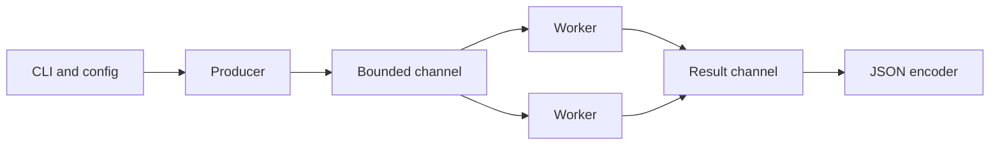

# Go for Security Engineering

Go provides static binaries, straightforward cross-compilation, cheap concurrency, strong networking libraries, and predictable deployment—excellent properties for portable scanners, collectors, proxies, and defensive agents.



## Module and toolchain

```shell-session
engineer@lab:~/probe$ go mod init example.org/security/probe
go: creating new go.mod: module example.org/security/probe
engineer@lab:~/probe$ go test ./...
ok      example.org/security/probe  0.007s
engineer@lab:~/probe$ CGO_ENABLED=0 GOOS=linux GOARCH=amd64 go build -trimpath -ldflags='-s -w' ./cmd/probe
```

## Concurrent TCP checker

```go
package main

import (
  "encoding/json"
  "fmt"
  "net"
  "os"
  "sync"
  "time"
)

type Result struct { Port int `json:"port"`; State string `json:"state"` }

func main() {
  host := "192.0.2.10"
  jobs, results := make(chan int), make(chan Result)
  var wg sync.WaitGroup
  for i := 0; i < 16; i++ {
    wg.Add(1)
    go func() {
      defer wg.Done()
      for port := range jobs {
        c, err := net.DialTimeout("tcp", fmt.Sprintf("%s:%d", host, port), 750*time.Millisecond)
        state := "closed-or-filtered"
        if err == nil { state = "open"; c.Close() }
        results <- Result{port, state}
      }
    }()
  }
  go func() { for _, p := range []int{22,80,443} { jobs <- p }; close(jobs); wg.Wait(); close(results) }()
  enc := json.NewEncoder(os.Stdout)
  for r := range results { enc.Encode(r) }
}
```

```shell-session
engineer@lab:~/probe$ ./probe
{"port":22,"state":"open"}
{"port":80,"state":"closed-or-filtered"}
{"port":443,"state":"open"}
```

Channels provide backpressure; a fixed worker count caps file descriptors and network pressure. Add `context.Context` for cancellation, `signal.NotifyContext` for graceful shutdown, and a rate limiter when probing shared infrastructure.

## Secure implementation checklist

- Parse IPs and URLs with standard packages; do not concatenate shell commands.
- Set deadlines on every socket and request.
- Cap response sizes with `io.LimitReader`.
- Use `crypto/rand`, `crypto/tls`, and constant-time comparison where applicable.
- Run `go test -race ./...`, `go vet ./...`, fuzz parsers, and produce an SBOM.
- Avoid embedding credentials with `-ldflags`; they remain recoverable from the binary.
- Sign releases and publish SHA-256 checksums.

```shell-session
engineer@lab:~/probe$ go test -race ./...
ok      example.org/security/probe  1.029s
engineer@lab:~/probe$ sha256sum probe
8f4744...  probe
```

## Context, cancellation & backpressure

Pass `context.Context` from CLI/API boundary through every blocking operation. A cancellation should stop producers, workers, and output cleanly. Use bounded channels; an unbounded slice of jobs merely moves resource exhaustion into memory.

```go
ctx, stop := signal.NotifyContext(context.Background(), os.Interrupt, syscall.SIGTERM)
defer stop()
req, _ := http.NewRequestWithContext(ctx, http.MethodGet, url, nil)
resp, err := client.Do(req)
```

Configure `http.Transport` connection pools, TLS minimums, proxy policy, idle timeouts, and response-body limits. Always close response bodies; drain only when safe and bounded.

## Interfaces & package design

Keep CLI parsing in `cmd/`, orchestration in an application package, protocols in adapters, and domain records independent of I/O. Small consumer-defined interfaces improve testing. Avoid interface abstractions before two implementations or a real test boundary exist.

## Profiling & observability

Use benchmarks, `pprof`, execution traces, runtime metrics, and the race detector. High goroutine count is not automatically a leak, but monotonically increasing blocked goroutines usually is.

```shell-session
engineer@lab:~$ go test -race -cover ./...
ok   example.org/secprobe/internal/scan  2.104s  coverage: 87.3%
engineer@lab:~$ go test -bench=. -benchmem ./internal/parser
BenchmarkParse-8  820000  1420 ns/op  256 B/op  3 allocs/op
```

## Crook2Root master project

Build a cross-platform concurrent TLS inventory tool. Include CIDR policy, exclusions, token-bucket rate limiting, per-host caps, contexts, SNI, certificate-chain parsing, JSONL, metrics, checkpoints, fuzz tests, race tests, profiling, SBOM, reproducible cross-builds, and signed checksums.

## Failure analysis

Deadlocks arise from cycles or missing channel closure; panics often result from concurrent map access or nil assumptions; leaks come from goroutines waiting after consumers exit. Capture goroutine profiles, use ownership rules for channel closing, and make cancellation tests part of CI.

---
> 🔼 Up: [[Programming for Security]]
