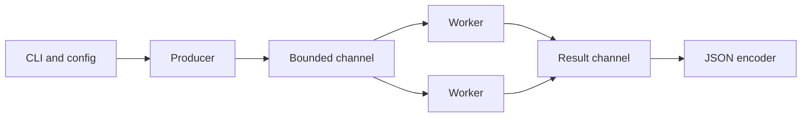

# Go for Security Engineering

Go provides static binaries, straightforward cross-compilation, cheap concurrency, strong networking libraries, and predictable deployment—excellent properties for portable scanners, collectors, proxies, and defensive agents.



## Module and toolchain

```shell-session
engineer@lab:~/probe$ go mod init example.org/security/probe
go: creating new go.mod: module example.org/security/probe
engineer@lab:~/probe$ go test ./...
ok      example.org/security/probe  0.007s
engineer@lab:~/probe$ CGO_ENABLED=0 GOOS=linux GOARCH=amd64 go build -trimpath -ldflags='-s -w' ./cmd/probe
```

## Concurrent TCP checker

```go
package main

import (
  "encoding/json"
  "fmt"
  "net"
  "os"
  "sync"
  "time"
)

type Result struct { Port int `json:"port"`; State string `json:"state"` }

func main() {
  host := "192.0.2.10"
  jobs, results := make(chan int), make(chan Result)
  var wg sync.WaitGroup
  for i := 0; i < 16; i++ {
    wg.Add(1)
    go func() {
      defer wg.Done()
      for port := range jobs {
        c, err := net.DialTimeout("tcp", fmt.Sprintf("%s:%d", host, port), 750*time.Millisecond)
        state := "closed-or-filtered"
        if err == nil { state = "open"; c.Close() }
        results <- Result{port, state}
      }
    }()
  }
  go func() { for _, p := range []int{22,80,443} { jobs <- p }; close(jobs); wg.Wait(); close(results) }()
  enc := json.NewEncoder(os.Stdout)
  for r := range results { enc.Encode(r) }
}
```

```shell-session
engineer@lab:~/probe$ ./probe
{"port":22,"state":"open"}
{"port":80,"state":"closed-or-filtered"}
{"port":443,"state":"open"}
```

Channels provide backpressure; a fixed worker count caps file descriptors and network pressure. Add `context.Context` for cancellation, `signal.NotifyContext` for graceful shutdown, and a rate limiter when probing shared infrastructure.

## Secure implementation checklist

- Parse IPs and URLs with standard packages; do not concatenate shell commands.
- Set deadlines on every socket and request.
- Cap response sizes with `io.LimitReader`.
- Use `crypto/rand`, `crypto/tls`, and constant-time comparison where applicable.
- Run `go test -race ./...`, `go vet ./...`, fuzz parsers, and produce an SBOM.
- Avoid embedding credentials with `-ldflags`; they remain recoverable from the binary.
- Sign releases and publish SHA-256 checksums.

```shell-session
engineer@lab:~/probe$ go test -race ./...
ok      example.org/security/probe  1.029s
engineer@lab:~/probe$ sha256sum probe
8f4744...  probe
```

---
> 🔼 Up: [[Programming for Security]]
