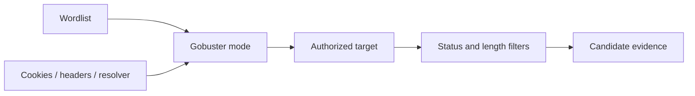

# Gobuster

Gobuster is a Go-based enumerator for web paths, virtual hosts, DNS labels, and supported cloud-storage namespaces. It is a request generator; status, length, redirects, and application behavior require interpretation.



## Installation

```shell-session
operator@lab:~$ sudo apt install gobuster
operator@lab:~$ gobuster version
3.x
```

## Modes and flags

| Mode | Use | Key options |
|---|---|---|
| `dir` | Paths/files | `-u`, `-w`, `-x`, `-s`, `-b`, `--exclude-length`, `-r` |
| `vhost` | Host-header routing | `-u`, `-w`, `--append-domain`, `--exclude-length` |
| `dns` | DNS labels | `-d`, `-w`, `-r`, `--wildcard`, `--show-ips`, `--show-cname` |
| cloud modes | Supported bucket names | provider-specific options in `--help` |

Global/HTTP controls include `-t/--threads`, `--delay`, `--timeout`, `-a/--useragent`, `-c/--cookies`, `-H/--headers`, `-k/--no-tls-validation`, `--proxy`, `--client-cert`, `--client-key`, `--no-error`, `--no-progress`, `-o`, and verbosity flags. Use `-k` only when scope requires an untrusted test certificate; record that verification was disabled.

```shell-session
operator@lab:~$ gobuster dir -u https://app.example.test -w approved-paths.txt -x html,json \
  -t 10 --delay 100ms --timeout 5s -b 404 --exclude-length 127 -o evidence/gobuster.txt
/health               (Status: 200) [Size: 31]
/admin                (Status: 403) [Size: 226]
/api                  (Status: 301) [Size: 169] [--> /api/]
```

Calibrate first: request several random nonexistent paths and note wildcard status, length, title, and redirect behavior. A 403 can prove existence; a 200 can be a custom-not-found page. Extension lists multiply request volume. Authenticated enumeration requires test cookies, but redact them from logs and command history.

```shell-session
operator@lab:~$ for p in does-not-exist-a does-not-exist-b; do curl -sk -o /dev/null -w "$p %{http_code} %{size_download}\n" "https://app.example.test/$p"; done
does-not-exist-a 200 127
does-not-exist-b 200 127
```

The repeated 127-byte baseline justifies `--exclude-length 127`.

## Authentication, state & response clustering

For authenticated discovery, use a dedicated low-privilege test identity. Confirm the session with a known authenticated page before enumeration and monitor expiration. A stale cookie can silently turn the entire run into login-page discovery.

```shell-session
operator@lab:~$ curl -sk -b 'session=REDACTED' -o /dev/null -w '%{http_code} %{size_download}\n' https://app.example.test/account
200 2841
operator@lab:~$ gobuster dir -u https://app.example.test -w approved-paths.txt \
  -c 'session=REDACTED' -H 'X-C2R-Test: authorized' -t 5 --delay 200ms --exclude-length 127
/account              (Status: 200) [Size: 2841]
/admin                (Status: 403) [Size: 226]
```

Store the command without the secret, record the test account and role separately, and invalidate the session during cleanup.

## Crook2Root interpretation lab

Create routes that return real 200, real 403, redirect-to-login, custom 404 with 200, and soft-delete 410 responses. Run Gobuster, then explain which flags reveal or hide each route. Repeat through a reverse proxy and compare body length, title, location, and cache headers.

## Troubleshooting

- Uniform responses: test random paths, filter stable length, and inspect titles/redirect locations.
- Missing virtual hosts: ensure DNS/SNI and Host header behavior match; HTTPS vhosts may require a resolvable name.
- Excessive errors: reduce threads, increase timeout, verify proxy/TLS, and inspect rate limiting.
- False path hits: compare content hashes and normalized bodies, not status alone.
- DNS wildcards: resolve random labels and use wildcard controls before trusting discovered names.

---
> 🔼 Up: [[Enumeration & Service Interaction Tools]]
