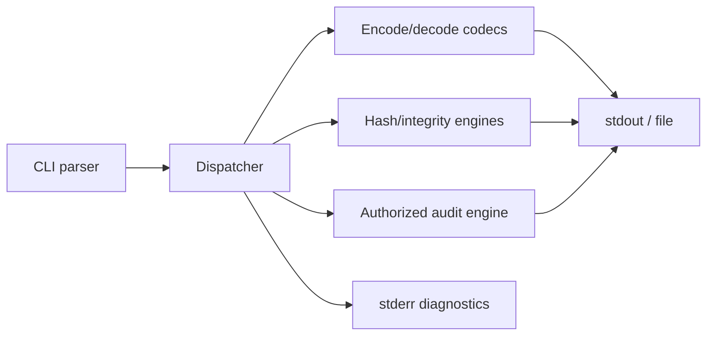
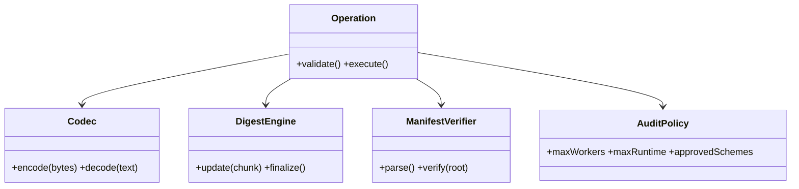

# Hashsmith Tool Architecture

Hashsmith is an open-source terminal utility for encoding, decoding, hashing, format identification, integrity verification, and authorized password-strength auditing. Its design separates reversible encodings from one-way hashes and makes every resource limit explicit.



## Interface contract

```shell-session
analyst@lab:~$ hashsmith encode --codec base64 --text 'Crook2Root'
Q3Jvb2syUm9vdA==
analyst@lab:~$ hashsmith hash --algorithm sha256 --file evidence.bin
sha256:7fe32b...  evidence.bin
analyst@lab:~$ hashsmith verify --manifest SHA256SUMS
evidence.bin: OK
```

Subcommands should expose machine-readable `--format json`, read bytes safely from stdin, refuse ambiguous text encodings, and keep diagnostics off stdout. The audit mode must require an explicit authorization acknowledgement, cap workers and runtime, never ship leaked-password lists, and report tested policy—not claim that a cryptographic hash was “decrypted.”

## Security design

- Use streaming digests so multi-gigabyte evidence does not enter memory.
- Compare digests in constant time where authenticity decisions depend on them.
- Distinguish Base64/hex decoding errors from character-decoding errors.
- Use Argon2id, scrypt, bcrypt, or PBKDF2 examples with salts for password storage; general hashes are integrity primitives.
- Zero mutable secret buffers when feasible and never log candidate secrets.
- Publish signed packages and reproducible checksums through central repositories.

```json
{"operation":"hash","algorithm":"sha256","path":"evidence.bin","bytes":1048576,"digest":"7fe32b...","status":"ok"}
```

## Tests

Use official algorithm vectors, round-trip properties for codecs, malformed-input fuzzing, large-stream tests, platform path tests, and deterministic benchmarks. Exit `0` for success, `1` for verification mismatch, and `2` for invalid invocation.

## Command model

Use explicit subcommands rather than mode-guessing:

```text
hashsmith encode   --codec base64|base32|hex|url [--text TEXT|--file PATH]
hashsmith decode   --codec ... [--strict] [--output PATH]
hashsmith hash     --algorithm sha256|sha512|blake2b [--file PATH|--stdin]
hashsmith identify --value VALUE [--format json]
hashsmith verify   --manifest FILE [--root DIRECTORY]
hashsmith audit    --scheme argon2id|bcrypt|scrypt --policy POLICY --authorized
```

Input-source options must be mutually exclusive. Binary output defaults to a file or encoded representation so terminal control bytes are not printed accidentally. `--` terminates option parsing before path operands.

## Internal interfaces



The CLI should parse into immutable operation objects. Core libraries must not print, read global environment state, or call `exit`; they return typed results/errors. This enables unit tests, embedding, and stable JSON output.

## Hash identification limits

Length and alphabet can produce candidates, not certainty. A 32-character hexadecimal value might be MD5, NTLM, an application identifier, or random bytes. Report confidence and reasons:

```json
{"value_length":32,"alphabet":"hex","candidates":[{"name":"md5","confidence":"low"},{"name":"ntlm","confidence":"low"}],"warning":"format alone is insufficient"}
```

## Password storage & auditing

Explain salt, pepper, work factor, memory hardness, versioning, and migration. Audit only supplied test hashes and approved candidate sources. Record policy and aggregate results without candidate secrets.

```shell-session
analyst@lab:~$ hashsmith audit --input canary-hashes.txt --policy enterprise-v3.toml --max-runtime 60s --workers 4 --authorized --format json
{"tested":12,"policy_failures":2,"recovered_canaries":1,"elapsed_ms":18422,"secrets_logged":false}
```

## Error model & exit codes

Differentiate invalid invocation, malformed encoding, unsupported algorithm, verification mismatch, I/O failure, policy refusal, and interrupted execution. Errors should identify byte offset or manifest line without leaking data. Stable exit codes make CI dependable.

## Crook2Root lab suite

1. Encode/decode UTF-8 and arbitrary binary fixtures.
2. Reject invalid padding and odd-length hex under strict mode.
3. Hash a multi-gigabyte sparse fixture with constant memory.
4. Verify a manifest containing valid, changed, missing, duplicated, and path-traversal entries.
5. Compare SHA-256 integrity use with Argon2id password storage.
6. Run bounded canary audit and prove candidates never enter logs.
7. Interrupt every operation and verify atomic output behavior.

## Packaging & supply chain

Publish source, changelog, SBOM, signatures, checksums, reproducible-build instructions, and pinned dependencies. Package-manager releases must map to signed source tags. CI should run vectors on Linux/macOS/Windows, fuzz decoders and manifests, scan dependencies, and verify installed CLI smoke tests.

---
> 🔼 Up: [[Writing Your Own Tools]]
