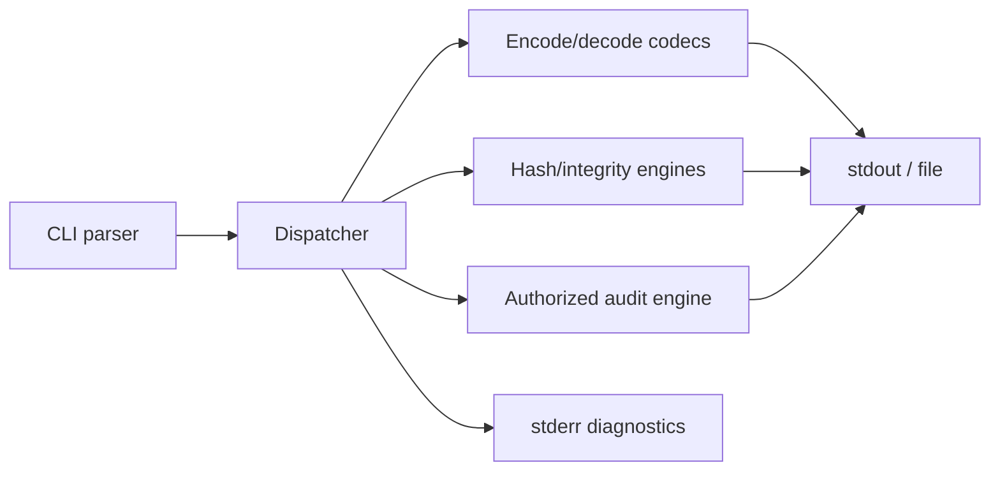

# Hashsmith Tool Architecture

Hashsmith is an open-source terminal utility for encoding, decoding, hashing, format identification, integrity verification, and authorized password-strength auditing. Its design separates reversible encodings from one-way hashes and makes every resource limit explicit.



## Interface contract

```shell-session
analyst@lab:~$ hashsmith encode --codec base64 --text 'Crook2Root'
Q3Jvb2syUm9vdA==
analyst@lab:~$ hashsmith hash --algorithm sha256 --file evidence.bin
sha256:7fe32b...  evidence.bin
analyst@lab:~$ hashsmith verify --manifest SHA256SUMS
evidence.bin: OK
```

Subcommands should expose machine-readable `--format json`, read bytes safely from stdin, refuse ambiguous text encodings, and keep diagnostics off stdout. The audit mode must require an explicit authorization acknowledgement, cap workers and runtime, never ship leaked-password lists, and report tested policy—not claim that a cryptographic hash was “decrypted.”

## Security design

- Use streaming digests so multi-gigabyte evidence does not enter memory.
- Compare digests in constant time where authenticity decisions depend on them.
- Distinguish Base64/hex decoding errors from character-decoding errors.
- Use Argon2id, scrypt, bcrypt, or PBKDF2 examples with salts for password storage; general hashes are integrity primitives.
- Zero mutable secret buffers when feasible and never log candidate secrets.
- Publish signed packages and reproducible checksums through central repositories.

```json
{"operation":"hash","algorithm":"sha256","path":"evidence.bin","bytes":1048576,"digest":"7fe32b...","status":"ok"}
```

## Tests

Use official algorithm vectors, round-trip properties for codecs, malformed-input fuzzing, large-stream tests, platform path tests, and deterministic benchmarks. Exit `0` for success, `1` for verification mismatch, and `2` for invalid invocation.

---
> 🔼 Up: [[Writing Your Own Tools]]
