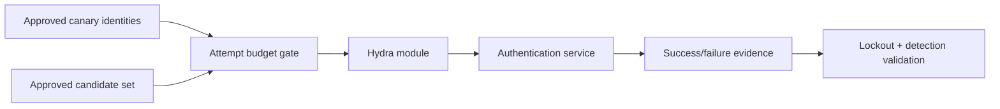

# Hydra

Hydra is a parallel authentication-testing client for many network protocols. In enterprise work it should validate rate limiting, lockout, password-policy exposure, and monitoring with tiny approved candidate sets—not perform uncontrolled password cracking.

> [!danger] Lockout & service risk
> Obtain explicit permission, known lockout thresholds, excluded identities, maintenance windows, maximum attempts per identity, and an emergency stop contact. Prefer dedicated canary accounts.



## Installation & protocol inventory

```shell-session
operator@lab:~$ sudo apt install hydra
operator@lab:~$ hydra -h | head -n 3
Hydra v9.x starting
Syntax: hydra [[[-l LOGIN|-L FILE] [-p PASS|-P FILE]] ...] TARGET SERVICE
operator@lab:~$ hydra -U ssh | head
Help for module ssh:
```

## Core flags

| Purpose | Flags |
|---|---|
| Identities | `-l` one login, `-L` login file |
| Candidates | `-p` one password, `-P` password file, `-e n|s|r` limited generated cases |
| Pairing | `-C` colon-separated login:password pairs |
| Concurrency | `-t` tasks per host, `-T` global tasks, `-w` response wait, `-W` connect wait |
| Stop behavior | `-f` after first valid pair per host, `-F` globally |
| Output | `-o`, `-b text|json|jsonv1`, `-v/-V/-d`, `-I` restore handling |
| Targets | direct target/service syntax, `-M` host list, `-s` port, `-S` SSL, `-O` legacy SSL |
| Network | `-4`, `-6`, proxy environment/config support by version |
| Resume | `hydra.restore` and `-R`; never resume without revalidating the attempt budget |

## Canary SSH validation

```shell-session
operator@lab:~$ printf '%s\n' 'Approved-Wrong-1!' 'Approved-Canary-2!' > candidates.txt
operator@lab:~$ hydra -l c2r-canary -P candidates.txt -t 1 -f -V -o evidence/hydra.txt ssh://192.0.2.20
[ATTEMPT] target 192.0.2.20 - login "c2r-canary" - pass "Approved-Wrong-1!" - 1 of 2
[22][ssh] host: 192.0.2.20   login: c2r-canary   password: Approved-Canary-2!
1 valid password found
```

Immediately rotate the canary credential after validation. Confirm the failed attempt and success appear in central telemetry with the expected source and account.

## HTTP form modules

Form modules require the path, encoded body, and a reliable failure or success condition. Dynamic anti-CSRF tokens, JavaScript workflows, MFA, and risk engines usually require a different test harness.

```text
/login:username=^USER^&password=^PASS^:F=Invalid credentials:H=X-C2R-Test\: authorized
```

Do not infer success solely from status code; inspect redirects, body markers, cookies, and side effects. Keep `-t 1`, tiny lists, and delays where service behavior is sensitive. Hydra’s breadth does not replace protocol-aware methodology.

## Attempt-budget engineering

Calculate the worst case before execution:

```text
20 accounts × 2 approved candidates = 40 attempts
At 1 task and one attempt every 3 seconds ≈ 2 minutes minimum
Lockout threshold = 5; planned per-account attempts = 2; safety margin = 3
```

Exclude service, emergency, executive, shared, and unknown-ownership identities unless individually approved. Domain-wide lockout and adaptive identity controls can correlate attempts across protocols and source addresses, so local arithmetic is not enough.

## Protocol-specific validation

Read module help with `hydra -U service`. SSH, SMB, RDP, FTP, mail, databases, and HTTP forms differ in TLS negotiation, domain syntax, failure messages, concurrency tolerance, and MFA behavior. Confirm one known-invalid and one canary-valid interaction manually before automation.

## Crook2Root lab

Create a canary identity with threshold five, central authentication logs, and an alert at two failures. Run two candidates at one task, verify one alert and no lockout, rotate the credential, then test a deliberately ambiguous web failure marker. Explain how the wrong marker creates a false success.

## Troubleshooting & evidence

- Immediate connection errors: validate service, address family, TLS mode, proxy, and source policy.
- Every candidate appears valid: failure/success condition is wrong or the application returns a uniform page.
- No valid result for known canary: inspect username/domain syntax, MFA, protocol version, keyboard/encoding, and rate controls.
- Account locked unexpectedly: stop all tasks, notify the owner, preserve command/timestamps, and invoke the RoE incident path.
- Restore file exists: do not resume automatically; recalculate authorization and attempt budget.

Evidence should include anonymized account class, attempt count, protocol, rate, source, timestamps, lockout status, defensive alert IDs, and cleanup/credential rotation—not reusable passwords.

---
> 🔼 Up: [[Exploitation & Credential Testing Tools]]
