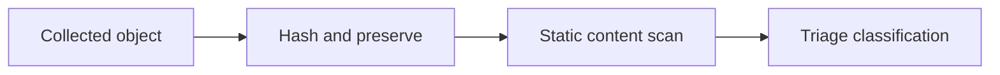

# Malware & Content Analysis Tools

Pattern-based classification of files, memory, and extracted objects with controlled rule quality and provenance.



- [[YARA]]

```shell-session
analyst@lab:~$ file sample.bin
sample.bin: data
analyst@lab:~$ sha256sum sample.bin
2d71...  sample.bin
```

---
> 🔼 Up: [[Defensive Tools]]
