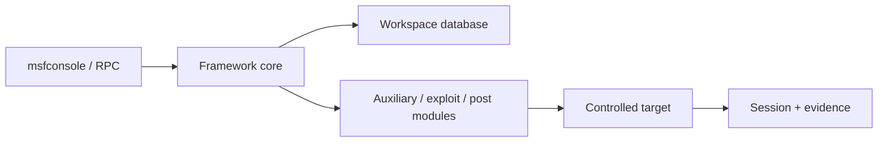

# Metasploit Framework

Metasploit Framework organizes modules, payload transports, sessions, workspaces, evidence, and post-validation actions. In enterprise testing, its value comes from repeatability and module metadata—not from indiscriminate exploitation.

> [!warning] Authorized validation only
> Reproduce modules in disposable targets first. Confirm target checks, side effects, rollback, endpoint monitoring, and the exact exploit boundary before a production validation.



## Installation and initialization

Use the official installer or supported distribution package. Keep the framework and module tree pinned for repeatability.

```shell-session
operator@lab:~$ msfconsole --version
Framework Version: 6.x
operator@lab:~$ msfdb init
Database already started
operator@lab:~$ msfconsole -q
msf6 > db_status
[*] Connected to msf. Connection type: postgresql.
```

## Console essentials

| Task | Commands |
|---|---|
| Find modules | `search`, filters such as `type:`, `platform:`, `cve:` |
| Select/read | `use`, `info`, `show options`, `show advanced`, `show targets` |
| Configure | `set`, `setg`, `unset`, `unsetg`, `save` |
| Validate | `check`, `run`, `exploit`, `run -j` where supported |
| Jobs/sessions | `jobs`, `jobs -K`, `sessions`, `sessions -i ID`, `sessions -K` |
| Data | `workspace`, `hosts`, `services`, `vulns`, `loot`, `notes` |
| Routing | `route`, `sessions`, SOCKS auxiliary modules—only under approved pivot scope |
| Resources | `resource file.rc`, `makerc` |

## Bounded module workflow

```shell-session
msf6 > workspace -a client-lab
[*] Added workspace: client-lab
msf6 > search cve:2099-0001 type:auxiliary
Matching Modules
================
0  auxiliary/scanner/example/safe_check  normal  No  Example safe version check
msf6 > use 0
msf6 auxiliary(scanner/example/safe_check) > info
msf6 auxiliary(scanner/example/safe_check) > set RHOSTS 192.0.2.10
RHOSTS => 192.0.2.10
msf6 auxiliary(scanner/example/safe_check) > set THREADS 2
THREADS => 2
msf6 auxiliary(scanner/example/safe_check) > run
[+] 192.0.2.10:443 - Version indicates candidate exposure; manual verification required
```

`check` support varies and may still send meaningful traffic. Inspect module source and references. `RHOSTS`, `RPORT`, `TARGET`, `SSL`, `VHOST`, timeouts, credentials, and payload options must all match the lab reproduction.

## Payload and session discipline

Use benign proof actions and client-controlled callback infrastructure. Never disable defensive controls or install persistence merely to stabilize a session. Set finite session timeouts, encrypt transport, log operator commands, and terminate all jobs/listeners during cleanup. Database workspaces can contain credentials and loot; encrypt backups and purge them according to the evidence policy.

Resource scripts improve repeatability:

```text
workspace client-lab
use auxiliary/scanner/example/safe_check
set RHOSTS file:approved-hosts.txt
set THREADS 2
run
```

Review scripts before execution and keep target exclusions outside mutable console history.

## Module anatomy

A module defines metadata, options, target checks, protocol interaction, exploitation/validation logic, cleanup behavior, and references. Read its source. Pay particular attention to `CheckCode` results, default target, architecture, payload compatibility, `AutoCheck`, failure handlers, and cleanup registration. “Excellent” reliability does not guarantee safety for a specific deployment.

## Workspaces & data hygiene

```shell-session
msf6 > workspace -a c2r-client-2026
[*] Added workspace: c2r-client-2026
msf6 > hosts -a 192.0.2.10 -n web01 -c 'authorized fixture'
msf6 > services -a -r tcp -p 443 -s https 192.0.2.10
msf6 > hosts
address      name   os_name  purpose  info
192.0.2.10  web01                    authorized fixture
```

Separate clients and engagements into distinct databases or strongly controlled workspaces. Loot, credentials, notes, and session output are sensitive evidence. Set retention, encryption, access, and deletion policies before collection.

## Crook2Root module-validation lab

1. Read `info -d` and module source.
2. Recreate the exact vulnerable version in an isolated range.
3. Run `check` while capturing packets and target telemetry.
4. Run a benign proof with a finite handler timeout.
5. Observe artifacts, health impact, and defensive alerts.
6. Execute cleanup, restart if required, and verify trusted state.
7. Repeat against the fixed version and require a safe negative result.

## Troubleshooting

- `check` unknown: module cannot establish exposure safely; gather independent evidence.
- Handler receives no session: inspect callback route, NAT, listener bind, egress policy, payload architecture, and endpoint logs.
- Session dies: verify target stability and payload compatibility; do not disable security controls to force persistence.
- Database disconnected: repair PostgreSQL/workspace state before collecting evidence.
- Module says completed but no proof: inspect module success predicate and target-side evidence.

## Defensive integration

Purple-team runs should publish source/destination, module behavior, expected process/network/file telemetry, and cleanup. The goal is stable behavior replay and detection validation—not concealment from the defending team.

---
> 🔼 Up: [[Exploitation & Credential Testing Tools]]
