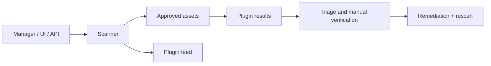

# Nessus

Nessus is a plugin-based vulnerability assessment platform. Its operational value depends on policy design, safe checks, authenticated coverage, credential health, plugin freshness, segmentation, and disciplined verification.



## Deployment and installation

Obtain the package from the vendor, verify its signature/checksum, install it on a dedicated scanner, activate the licensed feed, and protect the management interface with TLS and restricted administration. Scanner placement must provide intended network visibility without bypassing controls accidentally.

```shell-session
admin@scanner:~$ sudo systemctl status nessusd --no-pager
● nessusd.service - The Nessus Vulnerability Scanner
   Active: active (running)
admin@scanner:~$ sudo /opt/nessus/sbin/nessuscli update --plugins-only
Plugins updated successfully
```

Use the exact vendor command for the installed release; paths and CLI subcommands vary.

## Policy architecture

| Control | Enterprise decision |
|---|---|
| Targets | Asset inventory query, explicit CIDRs, exclusions, ownership |
| Discovery | Ping methods, “scan unresponsive hosts,” DNS behavior |
| Ports | Common, custom, or all; local port enumeration with credentials |
| Assessment | Safe checks, plugin families, service detection, web tests |
| Credentials | SSH keys/sudo, Windows account, database/network-device credentials |
| Performance | Hosts per scan, checks per host, timeouts, max runtime |
| Reporting | Evidence retention, severity model, accepted risk, ticket mapping |

Authenticated scanning reduces inference by querying package, registry, patch, and configuration state. Validate credential success per host; a scan with failed credentials is effectively unauthenticated and should not be compared as equivalent coverage.

## API workflow

The REST API uses version-dependent endpoints and token/session authentication. Consult the installed API documentation before automation and store secrets outside scripts.

```shell-session
automation@runner:~$ curl -sS -H 'X-ApiKeys: accessKey=REDACTED; secretKey=REDACTED' \
  https://nessus.example.test:8834/scans | jq '.scans[] | {id,name,status}'
{
  "id": 42,
  "name": "Weekly authenticated servers",
  "status": "completed"
}
```

## Reading a result

Plugin severity is a starting point. Inspect plugin output, detection method, affected endpoint, credential status, CVE/CPE mapping, exploitability, business role, exposure, compensating controls, and recency. Version banners can be misleading because vendors backport patches.

```text
Plugin: Example TLS Configuration Finding
Evidence: protocol accepted during negotiated handshake
Scanner confidence: direct observation
Business context: public customer gateway
Verification: reproduced with independent TLS client
Disposition: confirmed; remediation owner Platform Security
```

Never enable denial-of-service plugins or intrusive checks merely because a template includes them. Schedule fragile assets separately, monitor scanner health and target telemetry, and define abort criteria. Retests should use the same evidence-producing check plus an independent validation.

## Credentialed assessment mastery

Credentialed coverage is a system, not a checkbox. For Linux, validate SSH authentication, privilege elevation, package-manager visibility, and command restrictions. For Windows, validate account rights, remote service/firewall prerequisites, registry/WMI access, and whether the scanner actually inspected local patch/configuration state.

```text
Assets scheduled:             120
Hosts reachable:              117
Credential checks attempted:  117
Credential checks successful: 103
Coverage gap:                  14 reachable hosts (12.0%)
```

Report that gap prominently; otherwise stakeholders may interpret inferred remote checks as authenticated certainty.

## Scan design by asset class

Create separate policies for general servers, domain controllers, databases, network appliances, cloud workloads, and fragile/operational technology. Each class needs owner-approved ports, plugin families, concurrency, maintenance windows, credentials, and abort conditions. A single “scan everything” policy hides risk and reduces reproducibility.

## Crook2Root lab

Scan three fixtures: fully patched, vulnerable by version, and patched through vendor backport. Compare unauthenticated and authenticated results, inspect plugin output, verify with package/advisory evidence, and document why banner-based logic misclassifies the backported host.

## Troubleshooting & operations

- Missing hosts: inspect discovery method, routing, scanner placement, and “unresponsive” settings.
- Credential failure: separate authentication, authorization, sudo/UAC, and endpoint-policy failures.
- Scan stuck/running long: inspect checks per host, dead services, timeouts, scanner CPU/RAM, and plugin family.
- Severity disagreement: distinguish CVSS base score, vendor severity, environmental context, and accepted risk.
- Duplicate findings: normalize asset identity across DHCP, DNS, cloud IDs, and load balancers.

Track plugin-feed age, scan age, credential success, unreachable assets, false-positive rate, mean validation time, remediation SLA, and rescan closure.

---
> 🔼 Up: [[Vulnerability Assessment Tools]]
