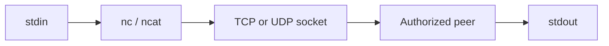

# Netcat

Netcat reads and writes byte streams over TCP or UDP. It is useful for connectivity checks, banner inspection, lab listeners, protocol experiments, and controlled file-transfer demonstrations. Implementations differ: OpenBSD `nc`, traditional Netcat, Ncat, and BusyBox do not share every flag.



## Identify the implementation

```shell-session
operator@lab:~$ nc -h 2>&1 | head -n 2
OpenBSD netcat (Debian patchlevel 1.226-1ubuntu2)
usage: nc [-46CDdFhklNnrStUuvZz] ...
```

## Common flags

| Flag | Meaning |
|---|---|
| `-l` | Listen mode |
| `-n` | No DNS resolution |
| `-v`, `-vv` | Verbose diagnostics |
| `-z` | Zero-I/O connect scan |
| `-w seconds` | Timeout |
| `-u` | UDP |
| `-4`, `-6` | Address family |
| `-p` | Local source/listen port, implementation-dependent |
| `-s` | Source address |
| `-q` / `-N` | Close behavior after stdin EOF, implementation-dependent |
| `-x`, `-X` | Proxy address/protocol in OpenBSD variants |
| `-k` | Keep listener open where supported |
| `--ssl` | Ncat TLS mode, not standard OpenBSD `nc` |

## Connectivity and banner checks

```shell-session
operator@lab:~$ nc -nvz -w 2 192.0.2.10 22 443
Connection to 192.0.2.10 22 port [tcp/*] succeeded!
Connection to 192.0.2.10 443 port [tcp/*] succeeded!
operator@lab:~$ printf 'HEAD / HTTP/1.1\r\nHost: app.example.test\r\nConnection: close\r\n\r\n' | nc -nv 192.0.2.10 80
(UNKNOWN) [192.0.2.10] 80 (http) open
HTTP/1.1 301 Moved Permanently
Location: https://app.example.test/
```

## Controlled lab listener

```shell-session
lab-a$ nc -lv 9000
Listening on 0.0.0.0 9000
lab-b$ printf 'C2R connectivity canary\n' | nc -N 192.0.2.20 9000
```

Plain Netcat provides no confidentiality, peer authentication, or integrity. Do not use it to move secrets. For production troubleshooting, prefer TLS-aware tools, SSH, or a protocol-native client. Never expose an unauthenticated shell listener; some legacy `-e` implementations can execute programs and create immediate remote-code risk.

For UDP, success is not confirmed by a lack of error. Capture both ends or use an application-layer acknowledgment.

## Protocol construction lab

Netcat is most educational when you manually construct a small protocol exchange. This exposes line endings, framing, half-close behavior, and timeouts that higher-level clients hide.

```shell-session
operator@lab:~$ printf 'EHLO assessment.example\r\nQUIT\r\n' | nc -nv -w 3 192.0.2.25 25
(UNKNOWN) [192.0.2.25] 25 (smtp) open
220 mail.example.test ESMTP
250-mail.example.test
250 STARTTLS
221 Bye
```

Do not submit `VRFY`, credentials, or messages unless those actions are in scope. For TLS services, use a TLS-aware client or Ncat’s TLS mode with certificate verification rather than sending plaintext to port 443.

## Data transfer with integrity

In an isolated range, a listener can demonstrate stream transfer, but Netcat does not prove identity or integrity. Hash on both sides and never use this pattern for sensitive enterprise evidence.

```shell-session
receiver$ nc -l 9001 > received.bin
sender$ nc -N 192.0.2.20 9001 < canary.bin
receiver$ sha256sum received.bin
3f91...  received.bin
```

## Troubleshooting

- Immediate refusal: host reachable but no listener, or active reject policy.
- Timeout: drop policy, route failure, wrong address family, or listener bound elsewhere.
- Listener receives nothing: inspect bind address, firewall, NAT, and implementation-specific `-p/-N/-q` behavior.
- Truncated stream: coordinate EOF/half-close and compare byte counts plus hashes.
- UDP ambiguity: add an application acknowledgment and capture both endpoints.

## Defensive visibility

Raw listeners, unusual outbound destinations, and plaintext protocol probes appear in endpoint socket telemetry, firewall flows, and packet analysis. Purple-team labs should validate that the process identity and network event correlate.

---
> 🔼 Up: [[Enumeration & Service Interaction Tools]]
