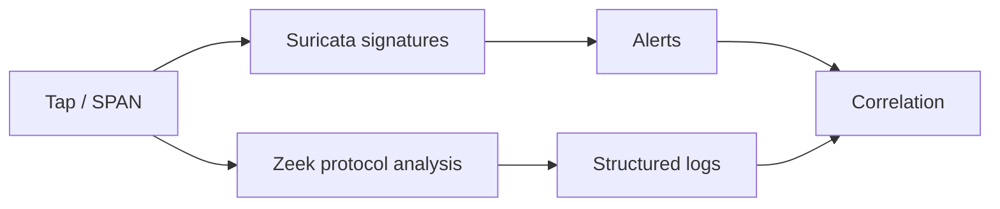

# Network Detection & Monitoring Tools

Signature detection and protocol-rich network telemetry for investigation and monitoring.



- [[Suricata]]
- [[Zeek]]

```shell-session
analyst@sensor:~$ printf '%s\n' 'capture_loss=0.00%' 'sensor_time_sync=ok'
capture_loss=0.00%
sensor_time_sync=ok
```

---
> 🔼 Up: [[Defensive Tools]]
