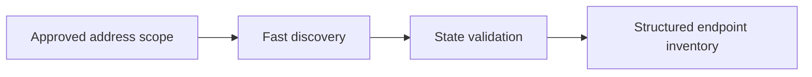

# Network Discovery Tools

Tools for finding reachable hosts and transport endpoints at controlled rates.



- [[Nmap]]
- [[Masscan]]
- [[RustScan]]

```shell-session
operator@lab:~$ printf '%s\n' '192.0.2.0/28' > approved-scope.txt
operator@lab:~$ wc -l approved-scope.txt
1 approved-scope.txt
```

---
> 🔼 Up: [[Offensive Tools]]
